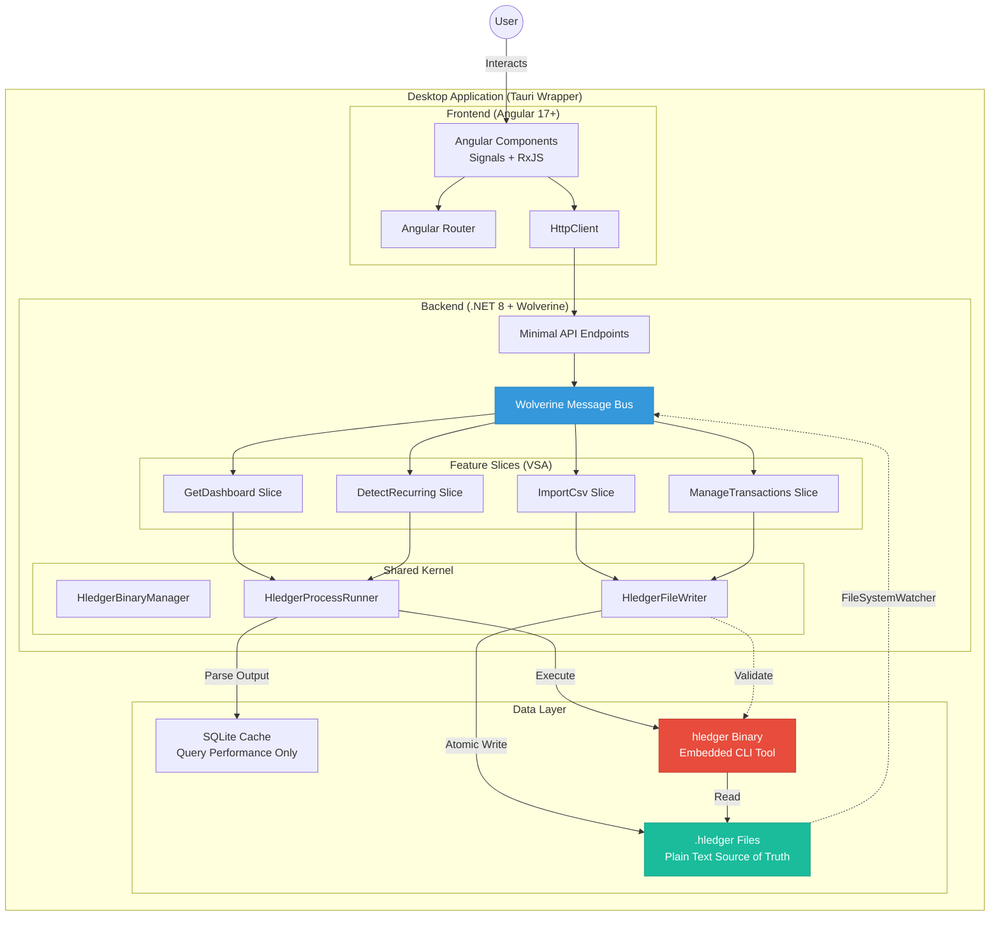
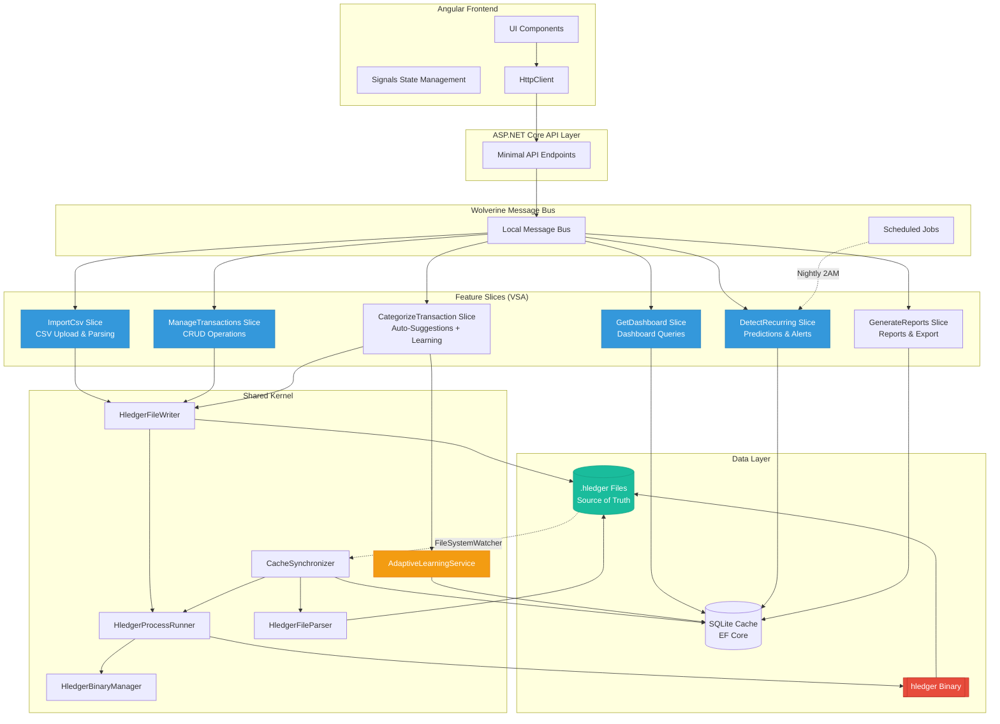
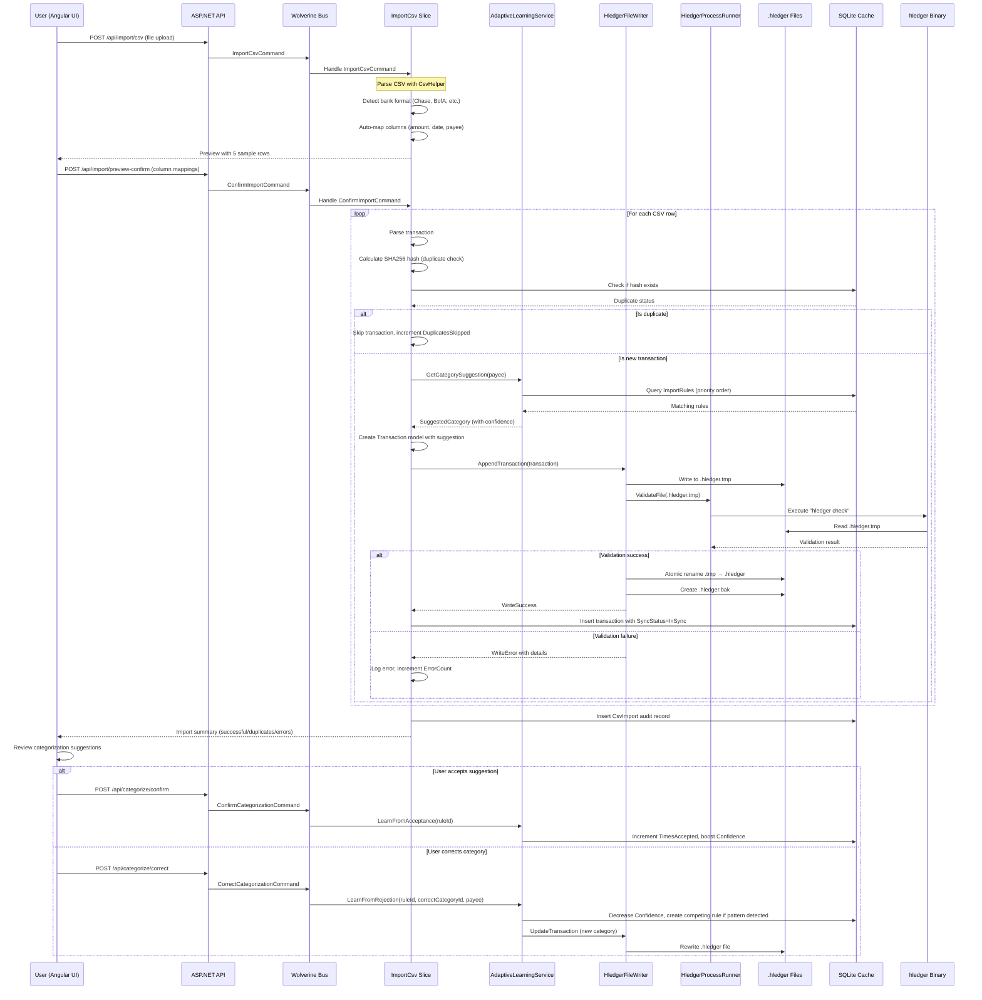
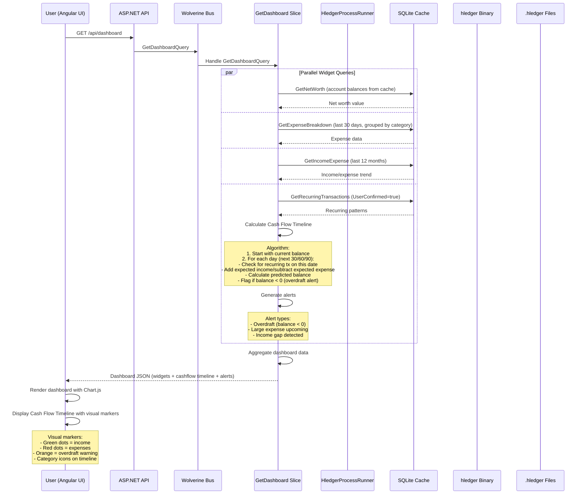
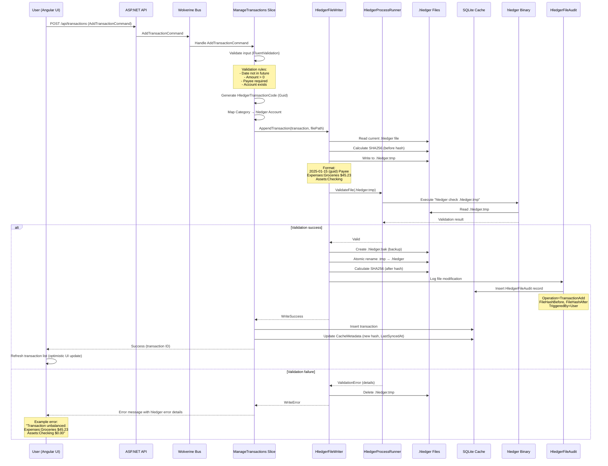
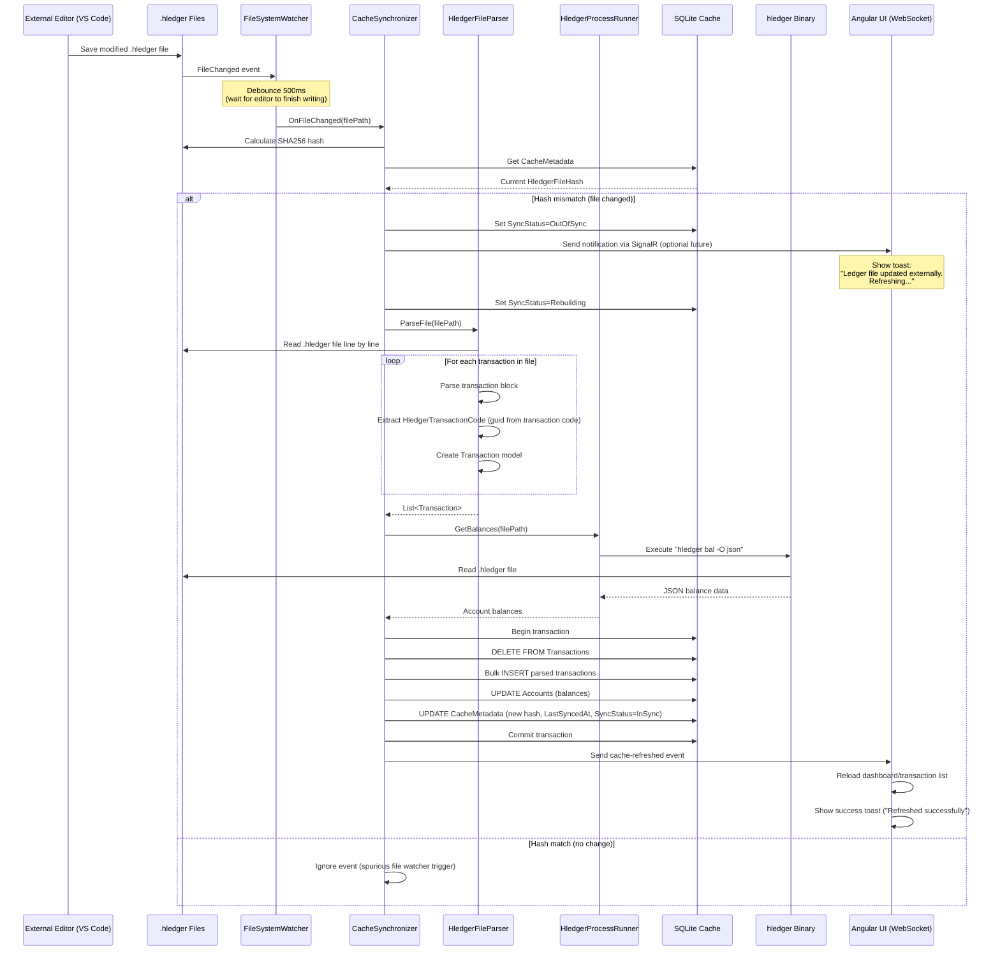
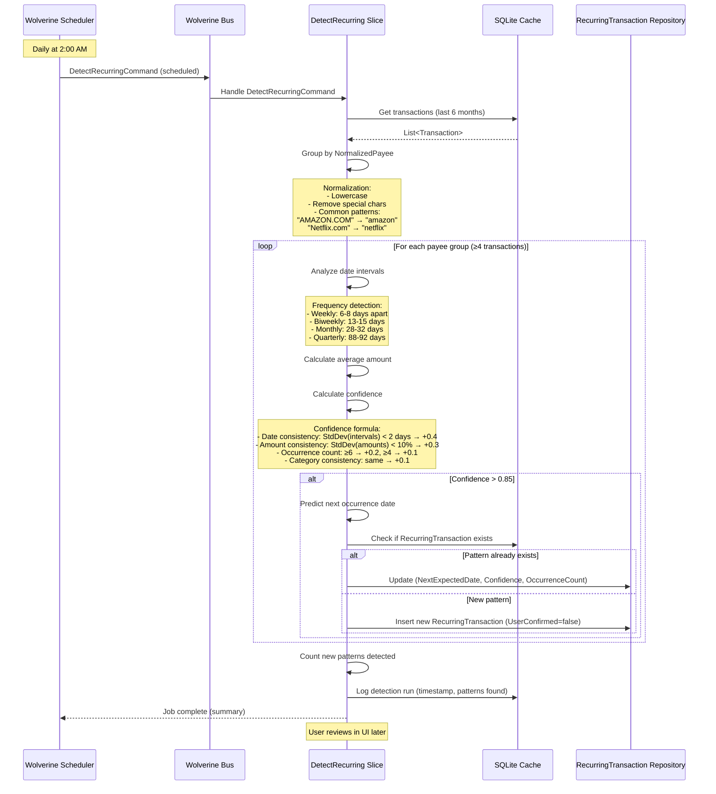
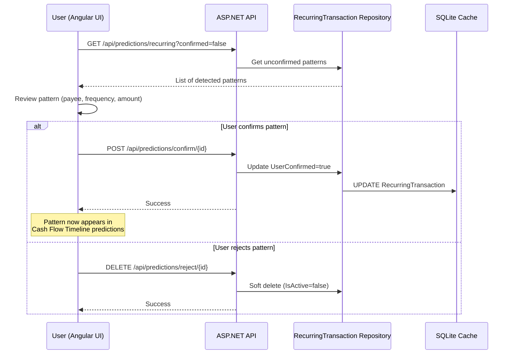

# Ledgerly Architecture Document

**Version:** 1.0 (Draft - In Progress)
**Date:** 2025-10-04
**Status:** Architecture Design Phase

## Change Log

| Date | Version | Description | Author |
|------|---------|-------------|--------|
| 2025-10-04 | 1.0 | Initial architecture creation | Winston (AI Architect) |

---

## Introduction

This document outlines the overall project architecture for Ledgerly, including backend systems, shared services, and non-UI specific concerns. Its primary goal is to serve as the guiding architectural blueprint for AI-driven development, ensuring consistency and adherence to chosen patterns and technologies.

**Relationship to Frontend Architecture:**
If the project includes a significant user interface, a separate Frontend Architecture Document will detail the frontend-specific design and MUST be used in conjunction with this document. Core technology stack choices documented herein (see "Tech Stack") are definitive for the entire project, including any frontend components.

### Starter Template or Existing Project

**Decision:** **No standard starter template** - This is a **greenfield project** with a highly specialized architecture.

**Analysis:**

Your PRD specifies a custom tech stack:
- **Backend:** .NET 8+ with Wolverine (event-driven messaging)
- **Frontend:** Angular 17+ with Signals
- **Desktop Wrapper:** Tauri 1.6+ (with Electron fallback)
- **Architecture:** Vertical Slice Architecture (VSA)

**Why No Template:**

1. **Wolverine + VSA pattern**: No standard template exists for this combination
2. **Embedded hledger binary**: Custom integration requirement
3. **Tauri wrapper**: Requires custom configuration with Angular + .NET backend
4. **Event-driven monolith**: Specific architectural pattern not in standard templates

**Recommendation:** Build from scratch using project scaffolding:
- `dotnet new webapi` for ASP.NET Core foundation
- `ng new` for Angular app
- `cargo create-tauri-app` for desktop wrapper
- Manual VSA structure setup (Features/ folders)

**Rationale:** The architectural uniqueness (VSA + Wolverine + embedded CLI tool + Tauri) makes a custom structure more appropriate than adapting a generic template. This gives you full control over the feature slice organization.

---

## High Level Architecture

### Technical Summary

Ledgerly employs an **event-driven monolith** architecture using **Vertical Slice Architecture (VSA)** to organize features as self-contained vertical slices. The system integrates an **embedded hledger binary** as the authoritative double-entry accounting engine, with plain text `.hledger` files serving as the single source of truth.

The backend uses **.NET 8 with Wolverine** for command/event handling, enabling async workflows (CSV import, recurring transaction detection) while maintaining simplicity appropriate for a local-first desktop application. The **Angular 17+ frontend** with Signals provides reactive UI updates, wrapped in a **Tauri desktop shell** for cross-platform distribution. **SQLite serves exclusively as a cache layer** for query performance—never storing authoritative financial data.

This architecture directly supports the PRD's core goals: offline-first operation (NFR6), PTA transparency through real hledger integration (FR21, FR23), and developer-friendly feature organization that enables rapid iteration by a solo developer.

### High Level Overview

**1. Architectural Style:** Event-Driven Monolith with Embedded CLI Integration

**2. Repository Structure:** Monorepo (single repository, multiple projects organized by VSA)
```
Ledgerly/
├── src/Ledgerly.Api/          # .NET backend with Wolverine
├── src/Ledgerly.Web/          # Angular frontend
├── src/Ledgerly.Desktop/      # Tauri wrapper
└── src/Ledgerly.Contracts/    # Shared DTOs
```

**3. Service Architecture:** Single-process desktop application with three integrated layers:
   - **Presentation Layer:** Angular SPA (TypeScript, Signals, RxJS)
   - **Application Layer:** .NET API + Wolverine message bus (commands/queries/events)
   - **Domain Layer:** Embedded hledger binary (battle-tested double-entry engine)

**4. Primary Data Flow:**
```
User Action (UI)
  → Angular HTTP Client
  → ASP.NET Minimal API Endpoint
  → Wolverine Command Handler
  → Write .hledger file (atomic)
  → Execute hledger binary (validation/calculation)
  → Parse output → Cache in SQLite
  → Return to UI
```

**5. Key Architectural Decisions:**

| Decision | Rationale | Trade-off Accepted |
|----------|-----------|-------------------|
| **Embedded hledger binary** | Avoid reimplementing 20+ years of battle-tested accounting logic; ensures PTA authenticity | Process spawning overhead (~50-200ms per query); dependency on external binary |
| **Vertical Slice Architecture** | Feature cohesion for solo developer; clear boundaries; parallel development of features | Some code duplication vs. premature abstraction (Rule of Three) |
| **Wolverine for messaging** | Local async workflows (import, predictions) without distributed system complexity | Learning curve for .NET developers unfamiliar with Wolverine |
| **Tauri over Electron** | 10-15MB bundles vs. 50-100MB; Rust security; native performance | Less mature ecosystem; **Week 1 validation gate** to confirm viability |
| **.hledger files as source of truth** | Complete data ownership, CLI interoperability, version control friendly | Need atomic write operations and cache invalidation logic |

### High Level Project Diagram



### Architectural and Design Patterns

**1. Vertical Slice Architecture (VSA)**
Each feature is organized as a self-contained vertical slice containing all layers (endpoint → handler → domain logic → tests).
**Rationale:** Solo developer friendly; features don't collide during parallel development; natural CQRS fit with Wolverine commands/queries. Aligns with PRD's VSA requirement and simplifies navigation (`Features/ImportCsv/` contains everything for CSV import).

**2. Command Query Responsibility Segregation (CQRS) - Lightweight**
Commands (ImportCsvCommand, AddTransactionCommand) modify state; Queries (GetDashboardQuery) read data. Wolverine enforces separation.
**Rationale:** Clear intent, optimized read paths (SQLite cache), write paths (hledger validation). Not full event sourcing—appropriate complexity for desktop app.

**3. Repository Pattern - Adapted for Plain Text**
`HledgerFileWriter` and `HledgerQueryRunner` abstract .hledger file operations and hledger CLI execution.
**Rationale:** Enables testing (mock file I/O and CLI calls); centralizes atomic write logic and parsing; future-proofs migration to different PTA formats (beancount).

**4. Event-Driven Architecture - Local Messaging**
Wolverine local message bus handles async workflows (CSV import → categorization suggestions → cache refresh).
**Rationale:** Decouples long-running operations from HTTP requests; enables scheduled jobs (nightly recurring transaction detection); supports future cloud sync without architectural rewrite.

**5. Cache-Aside Pattern**
SQLite caches hledger query results; cache invalidated on .hledger file changes (FileSystemWatcher trigger).
**Rationale:** hledger CLI queries can be 50-200ms; caching achieves <2s dashboard load (NFR1). Source of truth remains .hledger files.

**6. Strangler Fig Pattern - For hledger Integration**
Start with hledger CLI via ProcessStartInfo; optionally migrate to hledger library bindings (Haskell FFI) in Phase 2 if performance requires.
**Rationale:** De-risks MVP by using proven CLI; leaves optimization path open. Week 6 performance tests with 50K transactions will validate if migration needed.

**7. Atomic Transaction Pattern - File Operations**
Temp file → `hledger check` validation → rename to .hledger → create .hledger.bak backup.
**Rationale:** Prevents corruption (NFR11: zero data loss); ensures 100% validation compliance (NFR14).

**8. Adapter Pattern - CSV Parsing**
BankCsvAdapter interface with concrete implementations (ChaseAdapter, BofAAdapter) maps diverse CSV formats to standard transaction model.
**Rationale:** Handles 20+ bank CSV formats (FR2, NFR9: >95% success rate); isolates format-specific logic; enables community contributions for new bank formats.

---

## Tech Stack

### Cloud Infrastructure

**Provider:** None (Local-First Architecture)
**Key Services:** N/A for MVP - Phase 2 may introduce cloud sync (AWS S3/Azure Blob for backup, Cloudflare for distribution)
**Deployment Regions:** N/A - Desktop application with local execution only

### Technology Stack Table

| Category | Technology | Version | Purpose | Rationale |
|----------|-----------|---------|---------|-----------|
| **Language** | C# | 12 | Backend primary language | Nullable reference types, records for DTOs, pattern matching, top-level statements for minimal APIs |
| **Language** | TypeScript | 5.3.3 | Frontend primary language | Strong typing, excellent Angular tooling, team expertise per PRD |
| **Runtime** | .NET | 8.0.4 LTS | Backend runtime | Long-term support (Nov 2026), performance improvements, native AOT ready for future optimization |
| **Runtime** | Node.js | 20.11.0 LTS | Frontend build/dev tooling | LTS version (Apr 2026), stable performance, Angular CLI requirement |
| **Backend Framework** | ASP.NET Core | 8.0.4 | Web API foundation | Minimal APIs for endpoints, high performance, cross-platform |
| **Messaging Framework** | Wolverine | 3.0.0 | Command/event handling | Local message bus, async workflows, CQRS support, .NET native |
| **Frontend Framework** | Angular | 17.3.8 | SPA framework | Signals (reactive state), standalone components, tree-shaking, mature ecosystem |
| **State Management** | Angular Signals | 17.3.8 (built-in) | Reactive UI state | Built-in reactivity, simpler than NgRx for solo dev, excellent computed values |
| **Async Orchestration** | RxJS | 7.8.1 | Complex async workflows | HTTP streams, CSV import progress, WebSocket (future), proven patterns |
| **Desktop Wrapper** | Tauri | 1.6.1 | Cross-platform desktop | 10-15MB bundle, Rust security, native file I/O, process spawning (Week 1 validation required) |
| **Desktop Wrapper (Fallback)** | Electron | 29.1.0 | Backup if Tauri fails | Battle-tested, larger bundle acceptable if Tauri validation fails Week 1 |
| **UI Component Library** | Angular Material | 17.3.8 | Prebuilt UI components | Accessibility (WCAG AA), consistent design system, rapid prototyping |
| **Charting** | Chart.js | 4.4.2 | Data visualizations | Lightweight (61KB), interactive, sufficient for dashboard/reports, good documentation |
| **PDF Generation** | jsPDF | 2.5.1 | Report PDF export | Client-side PDF generation, Chart.js integration, no server dependency (FR16) |
| **Date/Time** | Luxon | 3.4.4 | Transaction date parsing | Timezone-safe, immutable, ISO 8601 support, successor to Moment.js |
| **ORM** | Entity Framework Core | 8.0.4 | SQLite data access | Code-first migrations, LINQ queries, change tracking for cache invalidation |
| **Database** | SQLite | 3.45.1 | Local caching only | Serverless, cross-platform, perfect for desktop apps, NOT for financial data (only cache) |
| **Database Encryption** | SQLCipher | 4.5.6 | Encrypted SQLite | AES-256 encryption at rest, seamless EF Core integration, privacy-first positioning |
| **CSV Parsing** | CsvHelper | 30.0.1 | Bank CSV import | 50M+ downloads, handles encoding/delimiters/edge cases, excellent error handling |
| **Double-Entry Engine** | hledger | 1.32.3 | Accounting calculations | Battle-tested (20+ years Ledger lineage), PTA community standard, JSON output support |
| **File Watching** | FileSystemWatcher | Built-in .NET | Detect external .hledger edits | Native .NET, cross-platform, triggers cache invalidation |
| **Validation** | FluentValidation | 11.9.1 | Input validation | Expressive syntax, testable, separates validation from domain logic |
| **Testing - Backend Unit** | xUnit | 2.7.0 | .NET unit tests | Modern, async-friendly, parameterized tests, popular in .NET community |
| **Testing - Backend Mocking** | NSubstitute | 5.1.0 | Test doubles | Clean syntax, easy mocking for HledgerProcessRunner and file I/O |
| **Testing - Frontend Unit** | Jest | 29.7.0 | Angular unit tests | Faster than Jasmine/Karma, better DX, snapshot testing, parallel execution |
| **Testing - E2E** | Playwright | 1.42.1 | Critical path validation | Cross-browser, cross-platform, auto-wait, traces/videos for debugging |
| **Testing - Test Data** | Bogus | 35.5.0 | Fake data generation | Generate realistic test transactions, deterministic seeds for repeatability |
| **Logging** | Serilog | 3.1.1 | Structured logging | JSON output, sinks for file/console, correlation IDs, easy debugging |
| **CI/CD** | GitHub Actions | N/A (SaaS) | Build/test automation | Free for public repos, matrix builds (Windows/macOS/Linux), GitHub integration |
| **Package Manager - Backend** | NuGet | Built-in .NET | .NET dependencies | Standard .NET package manager |
| **Package Manager - Frontend** | npm | 10.5.0 | Node.js dependencies | Standard Node.js package manager, lockfile for reproducibility |
| **Code Quality - Backend** | Roslyn Analyzers | Built-in .NET | Static code analysis | StyleCop rules, nullable analysis, enforce conventions |
| **Code Quality - Frontend** | ESLint | 8.57.0 | TypeScript linting | Angular recommended rules, enforce code style |
| **Code Formatting** | Prettier | 3.2.5 | Frontend code formatting | Consistent formatting, integrates with ESLint |

---

## Data Models

### Transaction

**Purpose:** Represents a single financial transaction in the double-entry accounting system. Core entity for all financial data with hledger synchronization support.

**Key Attributes:**
- `Id`: Guid - Cache identifier
- `HledgerTransactionCode`: Guid - Embedded in .hledger file as transaction code for identity mapping
- `Date`: DateTime - Transaction date (ISO 8601: YYYY-MM-DD)
- `Payee`: string - Merchant/person (e.g., "Whole Foods", "Amazon")
- `Amount`: decimal - Transaction amount (positive for income/expenses)
- `Account`: string - hledger account full path (e.g., "Assets:Checking")
- `Category`: string - User-friendly categorization
- `Memo`: string? - Optional description/notes
- `Status`: enum (Pending, Cleared, Reconciled) - Reconciliation status
- `IsSplit`: bool - Indicates if transaction has multiple postings
- `ParentTransactionId`: Guid? - Links split postings to parent transaction
- `Hash`: string - Duplicate detection (SHA256 of date+payee+amount for FR4)
- `SyncStatus`: enum (InSync, PendingWrite, WriteError, ConflictDetected) - Cache synchronization state
- `CreatedAt`: DateTime - Audit timestamp
- `UpdatedAt`: DateTime - Last modification timestamp
- `Source`: enum (Manual, CsvImport, ExternalEdit) - Origin tracking

**Relationships:**
- Belongs to one **Category** (classification)
- Belongs to one **Account** (posting source)
- May have associated **ImportRule** (if categorized via suggestion)
- May match a **RecurringTransaction** pattern
- Self-referential: Parent transaction has many child splits (`ParentTransactionId`)

**Design Decisions:**
- **`HledgerTransactionCode`:** Embeds Guid in .hledger file as transaction code (e.g., `2025-01-15 (abc-123) Whole Foods`). Solves identity problem for edits. hledger-native feature.
- **`SyncStatus`:** Tracks cache consistency. If .hledger write fails, status = `WriteError` → retry logic triggered.
- **Split support:** Read-only in MVP. When parsing .hledger, multi-posting transactions create parent + children with `ParentTransactionId`. UI displays but doesn't create splits.

**hledger File Example:**
```
2025-01-15 (550e8400-e29b-41d4-a716-446655440000) Whole Foods
    Expenses:Groceries    $45.23
    Assets:Checking
```

### Account

**Purpose:** Represents hledger account hierarchy. Simplified to use path strings as canonical representation.

**Key Attributes:**
- `Id`: Guid - Cache identifier
- `FullPath`: string - Complete hledger account path (e.g., "Expenses:Groceries:Organic") - **PRIMARY KEY for hledger sync**
- `Type`: enum (Asset, Liability, Equity, Income, Expense) - Account classification
- `Balance`: decimal - Current balance (cached from hledger calculations)
- `IsActive`: bool - User-defined visibility flag
- `CreatedAt`: DateTime - Audit timestamp
- `LastSyncedAt`: DateTime - Last hledger balance refresh timestamp

**Relationships:**
- Has many **Transactions** (postings)
- **Hierarchy computed on-the-fly** from `FullPath` string (no foreign key hierarchy)

**Design Decisions:**
- **Removed `ParentAccountId`:** Eliminates synchronization complexity. Parent derived from path: `"Expenses:Groceries:Organic".Split(':').SkipLast(1) → "Expenses:Groceries"`
- **`FullPath` as source of truth:** Matches hledger account declarations. No translation layer needed.
- **Balance caching:** Queried via `hledger bal -O json`, cached for dashboard performance. Invalidated on .hledger file changes.

**Computed Properties (Application Layer):**
- `ParentPath`: string - Derived from `FullPath` (e.g., "Expenses:Groceries" from "Expenses:Groceries:Organic")
- `DisplayName`: string - Last segment only (e.g., "Organic" from full path)
- `Depth`: int - Hierarchy level (e.g., 3 for "Expenses:Groceries:Organic")

### Category

**Purpose:** User-friendly classification for transactions, distinct from hledger accounts. Simplifies UI interactions.

**Key Attributes:**
- `Id`: Guid - Cache identifier
- `Name`: string - Display name (e.g., "Groceries", "Dining Out", "Salary")
- `Type`: enum (Expense, Income, Transfer) - Classification
- `Color`: string - Hex color for UI charts (e.g., "#1ABC9C")
- `Icon`: string? - Optional Material Icon name (e.g., "shopping_cart")
- `MappedAccount`: string - Corresponding hledger account full path (e.g., "Expenses:Groceries")
- `IsDefault`: bool - Seeded categories vs. user-created
- `DisplayOrder`: int - Sort order in UI dropdowns
- `IsActive`: bool - Soft delete flag

**Relationships:**
- Has many **Transactions**
- Has many **ImportRules** (category suggestion triggers)
- Has many **RecurringTransactions**

**Design Decisions:**
- **Categories vs. Accounts:** Categories are UI abstraction; Accounts are hledger-native. Category "Groceries" maps to "Expenses:Groceries" account.
- **Default categories seeded:** 15-20 common categories created on first launch (Groceries, Rent, Utilities, Salary, etc.)

### ImportRule

**Purpose:** Pattern-matching rules for automatic transaction categorization (FR6). Learns from user corrections.

**Key Attributes:**
- `Id`: Guid - Cache identifier
- `PayeePattern`: string - Pattern to match (e.g., "WHOLE FOODS", "AMAZON%")
- `MatchType`: enum (Exact, Contains, StartsWith, EndsWith, Regex) - Matching strategy
- `Priority`: int - Rule application order (1 = highest priority, stop on first match)
- `SuggestedCategoryId`: Guid - Category to suggest when pattern matches
- `Confidence`: decimal (0.0-1.0) - Accuracy score (incremented when user accepts suggestion)
- `TimesApplied`: int - Usage count (metric for learning effectiveness)
- `TimesAccepted`: int - User confirmation count
- `IsActive`: bool - User can disable rules
- `CreatedAt`: DateTime - Rule creation timestamp
- `LastUsedAt`: DateTime? - Last application timestamp

**Relationships:**
- Belongs to one **Category** (suggestion target)
- Applied to many **Transactions** (via categorization workflow)

**Design Decisions:**
- **`Priority` field:** Addresses performance risk. High-priority rules (user-created, high confidence) evaluated first. Prevents 1M+ pattern match problem.
- **Simple matching in MVP:** Regex support exists but not exposed in UI. Phase 2 adds ML-based learning (FR7).
- **Confidence calculation:** `Confidence = TimesAccepted / TimesApplied`. Rules with <0.3 confidence archived after 30 days.

### RecurringTransaction

**Purpose:** Detected recurring transaction patterns for cash flow predictions (FR17, FR18). User-confirmed to prevent false positives.

**Key Attributes:**
- `Id`: Guid - Cache identifier
- `Payee`: string - Recurring payee (e.g., "Netflix", "Rent")
- `NormalizedPayee`: string - Canonical payee name (e.g., "Amazon" for "Amazon.com", "AMAZON MKTP", "Amazon Prime")
- `AverageAmount`: decimal - Typical amount (±10% variance allowed)
- `Frequency`: enum (Weekly, Biweekly, Monthly, Quarterly, Yearly) - Recurrence pattern
- `ExpectedDayOfMonth`: int? - For monthly patterns (e.g., 1 for rent, 15 for salary)
- `NextExpectedDate`: DateTime - Predicted next occurrence
- `CategoryId`: Guid - Associated category
- `Confidence`: decimal (0.0-1.0) - Pattern reliability (based on consistency of dates/amounts)
- `UserConfirmed`: bool - User has verified this is legitimate recurring transaction (prevents false positive predictions)
- `OccurrenceCount`: int - Number of historical matches (minimum 4 required)
- `LastOccurrenceDate`: DateTime - Most recent transaction date
- `IsActive`: bool - User can disable patterns
- `CreatedAt`: DateTime - Pattern detection timestamp

**Relationships:**
- Belongs to one **Category**
- References multiple **Transactions** (historical matches via intermediate table)

**Design Decisions:**
- **`UserConfirmed` required for predictions:** Detected patterns don't appear in Cash Flow Timeline until user confirms. UI: "We detected 5 recurring transactions. Review and confirm."
- **`NormalizedPayee`:** Solves duplicate payee problem ("Amazon.com" vs "AMAZON MKTP"). Simple normalization in MVP (lowercase, remove special chars). Phase 2 adds ML-based merchant recognition.
- **Tightened detection:** Requires 4+ occurrences (not 3) and confidence >0.85 to reduce false positives.

### CsvImport

**Purpose:** Audit trail for CSV import operations. Tracks import history for troubleshooting and duplicate detection.

**Key Attributes:**
- `Id`: Guid - Cache identifier
- `FileName`: string - Original CSV filename
- `ImportedAt`: DateTime - Import timestamp
- `TotalRows`: int - CSV row count
- `SuccessfulImports`: int - Transactions successfully written to .hledger
- `DuplicatesSkipped`: int - Duplicate transaction count (FR4)
- `ErrorCount`: int - Parse/validation error count
- `BankFormat`: string? - Detected bank format (e.g., "Chase", "Bank of America")
- `ColumnMapping`: JSON - Stored mapping for future imports (FR3: manual mapping persistence)
- `FileHash`: string - SHA256 of CSV file (prevents re-importing same file)

**Relationships:**
- Has many **Transactions** (via `ImportId` foreign key on Transaction)

**Design Decisions:**
- **Column mapping storage:** JSON field stores user's manual mappings. Reused for same bank's future imports (matched by `BankFormat` or filename pattern).
- **Import deduplication:** `FileHash` prevents accidental re-import of same CSV file.

### HledgerFileAudit

**Purpose:** Audit trail for all .hledger file modifications. Critical for debugging and user trust in financial data integrity.

**Key Attributes:**
- `Id`: Guid - Cache identifier
- `Timestamp`: DateTime - Operation timestamp
- `Operation`: enum (CsvImport, TransactionAdd, TransactionEdit, TransactionDelete, ExternalEdit, CacheRebuild) - Operation type
- `FileHashBefore`: string - SHA256 of .hledger file before modification
- `FileHashAfter`: string - SHA256 after modification
- `TransactionCount`: int - Total transactions in file after operation
- `BalanceChecksum`: decimal - Sum of all account balances (quick consistency check)
- `TriggeredBy`: enum (User, System, External) - Operation source
- `ErrorMessage`: string? - If operation failed, error details
- `RelatedEntityId`: Guid? - Transaction/Import ID that triggered operation

**Relationships:**
- May reference **Transaction** (for transaction-specific operations)
- May reference **CsvImport** (for import operations)

**Design Decisions:**
- **Financial app requirement:** Audit trails build user trust. "Show History" feature in UI lets users see all file changes.
- **Retention policy:** Keep last 30 days detailed logs, summarize to monthly after.
- **Consistency validation:** `BalanceChecksum` enables quick detection of cache drift from .hledger file.

### CacheMetadata

**Purpose:** Tracks SQLite cache synchronization state with .hledger files. Solves dual-state problem.

**Key Attributes:**
- `Id`: int - Single row (PK = 1)
- `HledgerFilePath`: string - Path to .hledger source file
- `HledgerFileHash`: string - SHA256 of current .hledger file
- `LastSyncedAt`: DateTime - Last successful cache rebuild timestamp
- `TransactionCount`: int - Cached transaction count
- `SyncStatus`: enum (InSync, OutOfSync, Rebuilding, Error) - Overall cache state
- `HledgerVersion`: string - Version of hledger binary used (e.g., "1.32.3")
- `LastErrorMessage`: string? - Most recent sync error

**Design Decisions:**
- **Single-row table:** Only one .hledger file per app instance in MVP. Phase 2 may support multiple files.
- **Hash validation:** On app startup, compare `HledgerFileHash` with actual file SHA256. If mismatch → trigger cache rebuild.
- **Cache rebuild strategy:** If `OutOfSync`, parse .hledger file, re-execute hledger queries, rebuild all cache tables.

---

## Components

### Shared Kernel Components

#### HledgerBinaryManager

**Responsibility:** Manages embedded hledger binaries across platforms (Windows/macOS/Linux). Handles extraction, permissions, version verification, and platform detection.

**Key Interfaces:**
- `Task<string> GetHledgerBinaryPath()` - Returns path to platform-appropriate hledger executable
- `Task<bool> ValidateBinary()` - Verifies SHA256 hash and executes `hledger --version`
- `Task ExtractEmbeddedBinary()` - Extracts from embedded resources on first launch
- `Task<string> GetHledgerVersion()` - Returns hledger version string (e.g., "1.32.3")

**Dependencies:**
- File system I/O (System.IO)
- Platform detection (RuntimeInformation)
- Embedded resources (Assembly.GetManifestResourceStream)

**Technology Stack:**
- **Language:** C# 12
- **Platform Detection:** `RuntimeInformation.IsOSPlatform(OSPlatform.Windows/Linux/OSX)`
- **Embedded Binaries:** hledger 1.32.3 (Windows .exe, macOS arm64/x64, Linux x64)

#### HledgerProcessRunner

**Responsibility:** Executes hledger CLI commands via ProcessStartInfo, captures output (stdout/stderr), parses JSON/text responses, handles errors.

**Key Interfaces:**
- `Task<HledgerBalanceResult> GetBalances(string hledgerFilePath, string[]? accounts = null)` - Executes `hledger bal -O json`
- `Task<HledgerRegisterResult> GetRegister(string hledgerFilePath, DateRange? dateRange = null)` - Executes `hledger reg`
- `Task<ValidationResult> ValidateFile(string hledgerFilePath)` - Executes `hledger check`
- `Task<string> ExecuteCommand(string command, string[] args)` - Generic CLI execution wrapper

**Dependencies:**
- **HledgerBinaryManager** (gets binary path)
- Process execution (System.Diagnostics.Process)
- JSON parsing (System.Text.Json)
- Serilog (structured logging with correlation IDs)

**Technology Stack:**
- **Process Execution:** `ProcessStartInfo` with `RedirectStandardOutput = true`
- **JSON Parsing:** `System.Text.Json` for `hledger -O json` output
- **Timeout:** 30 seconds default (configurable for large files)

#### HledgerFileWriter

**Responsibility:** Atomic write operations to .hledger files. Handles formatting, validation, backups, and cache invalidation triggers.

**Key Interfaces:**
- `Task<WriteResult> AppendTransaction(Transaction transaction, string filePath)` - Adds transaction to .hledger file
- `Task<WriteResult> UpdateTransaction(Transaction oldTransaction, Transaction newTransaction, string filePath)` - Rewrites file with updated transaction
- `Task<WriteResult> DeleteTransaction(Guid transactionCode, string filePath)` - Comments out transaction in .hledger file
- `Task<WriteResult> BulkAppend(List<Transaction> transactions, string filePath)` - CSV import optimization

**Dependencies:**
- **HledgerProcessRunner** (for `hledger check` validation)
- **TransactionFormatter** (formats Transaction model to hledger syntax)
- File system I/O with atomic operations
- **CacheMetadata** repository (updates file hash after writes)

**Technology Stack:**
- **Atomic Write Strategy:** Write to `.hledger.tmp` → validate via `hledger check` → rename to `.hledger` (atomic on POSIX/NTFS)
- **Backup:** Create `.hledger.bak` before every write
- **Format:** 2-space indentation, right-aligned amounts (pad to column 40)

#### HledgerFileParser

**Responsibility:** Parses .hledger files into Transaction models for cache population. Handles external edits (FileSystemWatcher scenario).

**Key Interfaces:**
- `Task<List<Transaction>> ParseFile(string filePath)` - Full file parse
- `Task<Transaction?> FindTransactionByCode(Guid code, string filePath)` - Lookup by HledgerTransactionCode
- `Task<List<Account>> ExtractAccountDeclarations(string filePath)` - Parse account definitions

**Dependencies:**
- Text file parsing (Regex patterns for hledger syntax)
- **Data Models** (Transaction, Account)

**Technology Stack:**
- **Parsing:** Regex for transaction blocks, line-by-line parsing for multi-line postings

#### CacheSynchronizer

**Responsibility:** Keeps SQLite cache in sync with .hledger files. Handles FileSystemWatcher events, rebuilds cache, validates consistency.

**Key Interfaces:**
- `Task RebuildCache(string hledgerFilePath)` - Full cache rebuild from .hledger file
- `Task ValidateCache(string hledgerFilePath)` - Check file hash, balance checksums
- `void OnFileChanged(FileSystemEventArgs e)` - FileSystemWatcher event handler
- `Task<bool> IsCacheValid(string hledgerFilePath)` - Quick validation check

**Dependencies:**
- **HledgerFileParser** (parse .hledger files)
- **HledgerProcessRunner** (execute balance queries)
- **CacheMetadata** repository (track sync state)
- FileSystemWatcher (.NET built-in)
- EF Core (bulk insert/update cache tables)

**Technology Stack:**
- **FileSystemWatcher:** Monitors .hledger file directory for changes
- **Debouncing:** 500ms delay after file change before triggering rebuild

#### AdaptiveLearningService

**Responsibility:** Implements adaptive learning algorithm for categorization rules. Adjusts confidence, creates competing rules, detects patterns.

**Key Interfaces:**
- `Task LearnFromAcceptance(Guid ruleId)` - Boosts rule confidence when user accepts suggestion
- `Task LearnFromRejection(Guid ruleId, Guid correctCategoryId, string payee)` - Penalizes rule, creates competing rule if needed
- `Task LearnFromManualCategorization(Transaction transaction, Guid categoryId)` - Detects patterns in manual categorizations
- `Task<List<ImportRule>> GetTopRulesByConfidence(int count)` - Returns highest-confidence rules for UI display

**Dependencies:**
- **ImportRule** repository
- **Transaction** repository (pattern analysis)

**Algorithm:**
```
When user accepts suggestion:
  - Increment ImportRule.TimesAccepted
  - Boost Confidence: NewConfidence = (TimesAccepted / TimesApplied) * 1.1 (max 1.0)
  - Increase Priority if Confidence > 0.8

When user rejects suggestion:
  - Decrement Confidence: NewConfidence = (TimesAccepted / TimesApplied) * 0.9
  - Decrease Priority if Confidence < 0.3
  - Create competing rule if user-selected category appears 3+ times for same payee pattern

When user manually categorizes (no suggestion):
  - Check if similar payee pattern exists in last 20 transactions
  - If 3+ matches with same category, create new ImportRule with Confidence = 0.6
```

### Feature Slice Components

#### ImportCsv Slice

**Responsibility:** Complete CSV import workflow - upload, parse, detect columns, map fields, suggest categories, detect duplicates, write to .hledger file.

**Key Interfaces:**
- `POST /api/import/csv` → `ImportCsvCommand` handler
- `POST /api/import/preview` → `PreviewCsvCommand` handler
- `GET /api/import/mappings` → `GetSavedMappingsQuery` handler
- `POST /api/import/save-mapping` → `SaveColumnMappingCommand` handler

**Dependencies:**
- **CsvHelper** library
- **HledgerFileWriter**
- **ImportRule** repository
- **Transaction** repository
- **CsvImport** repository

#### GetDashboard Slice

**Responsibility:** Query cached data for all dashboard widgets including the **prominent Cash Flow Timeline** (primary differentiator).

**Key Interfaces:**
- `GET /api/dashboard` → `GetDashboardQuery` handler
- `GET /api/dashboard/networth` → `GetNetWorthQuery` handler
- `GET /api/dashboard/expenses` → `GetExpenseBreakdownQuery` handler
- `GET /api/dashboard/income-expense` → `GetIncomeExpenseQuery` handler
- `GET /api/dashboard/cashflow-timeline?days={30|60|90}` → `GetCashFlowTimelineQuery` handler

**Cash Flow Timeline Response:**
```json
{
  "currentBalance": 2500.00,
  "asOfDate": "2025-01-15",
  "predictions": [
    {
      "date": "2025-01-16",
      "predictedBalance": 2455.00,
      "confidence": 0.95
    }
  ],
  "recurringMarkers": [
    {
      "date": "2025-01-15",
      "payee": "Netflix",
      "amount": -15.99,
      "categoryName": "Entertainment",
      "categoryIcon": "movie",
      "categoryColor": "#9B59B6"
    }
  ],
  "alerts": [
    {
      "type": "Overdraft",
      "date": "2025-02-15",
      "message": "Predicted overdraft on Feb 15 ($-45.00)",
      "actionableSuggestion": "Consider reducing discretionary spending or transferring funds",
      "impact": 45.00
    }
  ]
}
```

**Dependencies:**
- **Transaction** repository
- **Account** repository
- **RecurringTransaction** repository
- **HledgerProcessRunner**

#### ManageTransactions Slice

**Responsibility:** CRUD operations for transactions - add, edit, delete, search, filter, batch operations.

**Key Interfaces:**
- `POST /api/transactions` → `AddTransactionCommand` handler
- `PUT /api/transactions/{id}` → `UpdateTransactionCommand` handler
- `DELETE /api/transactions/{id}` → `DeleteTransactionCommand` handler
- `GET /api/transactions` → `GetTransactionsQuery` handler
- `POST /api/transactions/batch` → `BatchCategorizeCommand` handler

**Dependencies:**
- **HledgerFileWriter**
- **Transaction** repository
- **HledgerFileAudit** repository

#### DetectRecurring Slice

**Responsibility:** Detect recurring transaction patterns, generate cash flow predictions, alert on overdrafts.

**Key Interfaces:**
- `POST /api/predictions/detect` → `DetectRecurringCommand` handler (Wolverine scheduled job, nightly)
- `GET /api/predictions/recurring` → `GetRecurringTransactionsQuery` handler
- `POST /api/predictions/confirm/{id}` → `ConfirmRecurringCommand` handler
- `GET /api/predictions/cashflow` → `GetCashFlowPredictionQuery` handler

**Dependencies:**
- **Transaction** repository
- **RecurringTransaction** repository
- **Prediction Algorithm** (pattern matching)

**Technology:**
- **Scheduled Job:** Wolverine runs daily at 2 AM
- **Detection Algorithm:** Sliding window (last 6 months), minimum 4 occurrences

#### CategorizeTransaction Slice

**Responsibility:** Auto-suggest categories, apply import rules, **learn adaptively from user corrections** through Bayesian-inspired confidence adjustment.

**Key Interfaces:**
- `POST /api/categorize` → `CategorizeTransactionCommand` handler
- `POST /api/categorize/batch` → `BatchCategorizeCommand` handler
- `GET /api/categorize/suggestions/{transactionId}` → `GetCategorySuggestionsQuery` handler
- `POST /api/categorize/learn` → `LearnFromCorrectionCommand` handler

**Dependencies:**
- **ImportRule** repository
- **Transaction** repository
- **HledgerFileWriter**
- **AdaptiveLearningService**

**Learning Impact:**
- First CSV import: ~50% accuracy
- After 10 corrections: ~65% accuracy
- After 3 months: ~75-80% accuracy (FR7 target)

#### GenerateReports Slice

**Responsibility:** Category-based reports, time period filtering, comparisons, PDF/CSV export.

**Key Interfaces:**
- `GET /api/reports/expenses` → `GetExpenseReportQuery` handler
- `GET /api/reports/comparison` → `GetComparisonReportQuery` handler
- `POST /api/reports/export/pdf` → `ExportPdfCommand` handler

**Dependencies:**
- **Transaction** repository
- **Category** repository
- jsPDF (client-side PDF generation)

### Component Diagram



---

## Core Workflows

This section documents the critical user journeys with sequence diagrams showing interactions between frontend, backend, hledger binary, and data storage.

### CSV Import Workflow

**User Story:** User uploads bank CSV file, maps columns, reviews suggestions, confirms import.

**Success Criteria:**
- >95% successful transaction parsing (NFR9)
- Duplicate detection 100% accurate (FR4)
- Adaptive learning creates rules from corrections (FR6, FR7)



**Performance Targets:**
- 1000 transactions: <5 seconds import time
- Duplicate detection: O(n) with hash lookup
- Categorization suggestions: <50ms per transaction (priority-ordered rule matching)

---

### Dashboard Load with Cash Flow Timeline

**User Story:** User opens dashboard, sees net worth, expense breakdown, income/expense chart, and **Cash Flow Timeline with predictions**.

**Success Criteria:**
- Dashboard loads in <2 seconds (NFR1)
- Cash Flow Timeline shows 30/60/90 day predictions
- Overdraft alerts displayed if predicted balance <0



**Caching Strategy:**
- Account balances cached on app start (refreshed on .hledger file change)
- Recurring transactions cached (refreshed nightly via scheduled job)
- Dashboard queries hit cache only (no hledger CLI execution for <2s load)

---

### Add Transaction Manually

**User Story:** User adds transaction via UI form (date, payee, amount, category).

**Success Criteria:**
- Transaction written to .hledger file with atomic operations
- 100% validation via hledger binary (NFR14)
- Cache updated immediately for instant UI refresh



**Error Handling:**
- FluentValidation errors returned immediately (no file I/O)
- hledger validation errors preserved exactly as CLI output
- Rollback automatic (atomic rename fails → .tmp file deleted)
- Backup always created before modification

---

### External .hledger File Edit Detection

**User Story:** User edits .hledger file in VS Code while app is running. App detects change, rebuilds cache, shows notification.

**Success Criteria:**
- FileSystemWatcher detects changes within 500ms
- Cache rebuild completes within 2 seconds for <10K transactions
- UI shows non-blocking notification ("Ledger file updated externally. Refreshing...")



**Edge Cases Handled:**
- Multiple rapid saves → debounced to single rebuild
- File deleted → show error, preserve cache, disable writes
- File corrupted → show hledger error, preserve cache
- Concurrent writes (app + external) → last write wins, cache rebuilds

---

### Recurring Transaction Detection (Scheduled Job)

**User Story:** System runs nightly job to detect recurring patterns. User reviews/confirms patterns in UI.

**Success Criteria:**
- Nightly execution at 2 AM (Wolverine scheduled job)
- Minimum 4 occurrences + >0.85 confidence
- User confirmation required before predictions appear in Cash Flow Timeline



**User Confirmation Flow:**


---

## External APIs

Since Ledgerly is architected as a **local-first desktop application** with the hledger binary embedded, there are **no external APIs required for MVP functionality**. All accounting calculations, validations, and data processing occur locally through the hledger CLI.

**Future External API Considerations (Phase 2):**

If cloud sync or additional features are implemented in Phase 2, potential external APIs might include:
- **Cloud Storage APIs** (AWS S3, Azure Blob, Cloudflare R2) - For .hledger file backup/sync
- **Financial Institution APIs** (Plaid, Yodlee) - For direct bank transaction fetching (beyond CSV import)
- **Exchange Rate APIs** - For multi-currency support

**For MVP, this section is marked N/A.**

**Rationale:**
- **Offline-first by design**: NFR6 requires full functionality without internet
- **Data privacy**: No external transmission of financial data
- **hledger is embedded**: Not an external API—bundled binary
- **Simplifies architecture**: No API keys, rate limits, network error handling

---

## REST API Spec

**Internal REST API for Ledgerly desktop application.**

Backend: ASP.NET Core 8.0 with Minimal APIs
Frontend: Angular 17+ with Signals

All endpoints are local-only (`http://localhost:5000`) with no external authentication required for MVP (desktop app security boundary).

**Full OpenAPI 3.0 specification available at:** `docs/api/openapi.yaml` (extracted for readability)

### Key Endpoints Summary

**Import Endpoints:**
- `POST /api/import/preview` - Upload CSV and preview import
- `POST /api/import/confirm` - Confirm and execute CSV import
- `GET /api/import/mappings` - Get saved column mappings

**Transaction Endpoints:**
- `GET /api/transactions` - Get transactions (pagination, filtering, search)
- `POST /api/transactions` - Add new transaction
- `PUT /api/transactions/{id}` - Update transaction
- `DELETE /api/transactions/{id}` - Delete transaction (comment out in .hledger)
- `POST /api/transactions/batch` - Batch categorize transactions

**Dashboard Endpoints:**
- `GET /api/dashboard` - Get all dashboard data
- `GET /api/dashboard/networth` - Get current net worth
- `GET /api/dashboard/cashflow-timeline?days={30|60|90}` - **Cash flow predictions (PRIMARY DIFFERENTIATOR)**

**Predictions Endpoints:**
- `GET /api/predictions/recurring` - Get recurring transaction patterns
- `POST /api/predictions/recurring/{id}/confirm` - Confirm pattern
- `DELETE /api/predictions/recurring/{id}/reject` - Reject pattern
- `POST /api/predictions/detect` - Trigger detection (normally scheduled nightly)

**Categorization Endpoints:**
- `GET /api/categorize/suggestions/{transactionId}` - Get category suggestions
- `POST /api/categorize/confirm` - Confirm suggestion (triggers learning)
- `POST /api/categorize/correct` - Correct suggestion (triggers negative learning)

**Reports Endpoints:**
- `GET /api/reports/expenses` - Get expense report (time filtering, grouping)
- `POST /api/reports/export/pdf` - Export report data for client-side PDF generation

**Accounts & Categories:**
- `GET /api/accounts` - Get account hierarchy
- `GET /api/categories` - Get all categories

### API Design Decisions

**Key Decisions:**
1. **Local-only endpoints**: No authentication for MVP (Tauri security boundary)
2. **Minimal API style**: RESTful conventions with simple paths
3. **Pagination built-in**: All list endpoints support paging
4. **Client-side PDF**: `/reports/export/pdf` returns data, not binary PDF (jsPDF renders in Angular)
5. **Adaptive learning endpoints**: Explicit confirm/correct endpoints trigger learning algorithms
6. **UUID identifiers**: All entities use GUIDs for client-side ID generation compatibility

**Error Response Format:**
```json
{
  "errorCode": "HLEDGER_VALIDATION_FAILED",
  "message": "Transaction validation failed",
  "details": "...",
  "validationErrors": {},
  "timestamp": "2025-01-15T14:30:00Z",
  "traceId": "abc-123-def-456"
}
```

---

## Database Schema

**Purpose:** Query performance cache for hledger data (SQLite 3.45.1 with EF Core 8.0.4, SQLCipher 4.5.6 for encryption)

**CRITICAL:** This database is a **CACHE LAYER ONLY**. All authoritative financial data resides in .hledger files.

### Schema Design (v2.0 - with precision and concurrency fixes)

**Key Changes from v1.0:**
1. **Amount/Balance:** Changed from REAL to INTEGER (stores cents for exact precision)
2. **RowVersion:** Added for optimistic concurrency control
3. **CategoryId FK:** Added while keeping Category TEXT for dual-tracking
4. **CurrencyCode:** Added for future multi-currency support

### Core Tables

**Transactions Table:**
```sql
CREATE TABLE Transactions (
    Id TEXT PRIMARY KEY,
    HledgerTransactionCode TEXT NOT NULL UNIQUE,
    Date TEXT NOT NULL,  -- ISO 8601 YYYY-MM-DD
    Payee TEXT NOT NULL,
    Amount INTEGER NOT NULL,  -- Cents: 4523 = $45.23
    CurrencyCode TEXT NOT NULL DEFAULT 'USD',
    Account TEXT NOT NULL,
    CategoryId TEXT NULL,  -- FK to Categories
    Category TEXT NOT NULL,  -- Denormalized for .hledger sync
    Memo TEXT NULL,
    Status TEXT NOT NULL CHECK(Status IN ('Pending', 'Cleared', 'Reconciled')),
    IsSplit INTEGER NOT NULL DEFAULT 0,
    ParentTransactionId TEXT NULL,
    Hash TEXT NOT NULL,  -- SHA256 for duplicate detection
    SyncStatus TEXT NOT NULL CHECK(SyncStatus IN ('InSync', 'PendingWrite', 'WriteError', 'ConflictDetected')),
    CreatedAt TEXT NOT NULL DEFAULT (datetime('now')),
    UpdatedAt TEXT NOT NULL DEFAULT (datetime('now')),
    Source TEXT NOT NULL CHECK(Source IN ('Manual', 'CsvImport', 'ExternalEdit')),
    RowVersion INTEGER NOT NULL DEFAULT 1,  -- Optimistic concurrency

    FOREIGN KEY (ParentTransactionId) REFERENCES Transactions(Id) ON DELETE CASCADE,
    FOREIGN KEY (CategoryId) REFERENCES Categories(Id) ON DELETE SET NULL
);
```

**Other Core Tables:**
- **Accounts** - Account hierarchy (FullPath as primary key for hledger sync)
- **Categories** - User-friendly categorization with color/icon metadata
- **ImportRules** - Pattern matching for auto-categorization (Priority-ordered, Confidence stored as INTEGER 0-10000)
- **RecurringTransactions** - Detected patterns for predictions (UserConfirmed required)
- **CsvImports** - Import audit trail (FileHash prevents re-imports)
- **HledgerFileAudits** - File modification audit (BalanceChecksum as INTEGER)
- **CacheMetadata** - Single-row table tracking sync state (SchemaVersion field)
- **RecurringTransactionMatches** - Junction table

### Money Value Object Pattern

```csharp
public readonly struct Money
{
    private readonly long _cents;
    public string CurrencyCode { get; }

    public Money(decimal amount, string currencyCode = "USD")
    {
        _cents = (long)(amount * 100);  // $45.23 → 4523 cents
        CurrencyCode = currencyCode;
    }

    public decimal ToDecimal() => _cents / 100.0m;
    public long ToCents() => _cents;

    // Arithmetic operators...
}
```

### Optimistic Concurrency Example

```csharp
// EF Core checks: UPDATE Transactions SET Amount = 5000 WHERE Id = ? AND RowVersion = ?
try
{
    await _context.SaveChangesAsync();
}
catch (DbUpdateConcurrencyException ex)
{
    throw new ConflictException(
        "Transaction was modified by external editor. Please refresh and try again.",
        ex
    );
}
```

### Schema Rationale

**Key Decisions:**
1. **INTEGER for money** - Zero rounding errors, exact balance checksums (vs. REAL floating point)
2. **RowVersion triggers** - Detects external .hledger edits, prevents data loss
3. **Dual tracking (CategoryId + Category)** - Referential integrity + .hledger sync
4. **TEXT for GUIDs** - SQLite standard practice
5. **JSON as TEXT** - ColumnMapping stored as JSON string (EF Core serializes)

**Full schema SQL available at:** `src/Ledgerly.Api/Common/Data/schema.sql`

---

## Source Tree

**Monorepo structure using Vertical Slice Architecture (VSA)**

```plaintext
Ledgerly/                                    # Monorepo root
├── .github/workflows/
│   ├── build.yml                            # CI: Build + Test
│   ├── release.yml                          # CI: Cross-platform Tauri builds
│   └── codeql.yml                           # Security scanning
├── docs/
│   ├── architecture/                        # Sharded architecture docs
│   │   ├── architecture.md                  # This file
│   │   ├── coding-standards.md
│   │   └── tech-stack.md
│   ├── prd/                                 # Product requirements
│   └── api/openapi.yaml                     # OpenAPI spec
├── scripts/
│   ├── bootstrap.sh                         # Setup dev environment
│   ├── build-all.sh
│   └── test-all.sh
├── src/
│   ├── Ledgerly.Api/                        # .NET 8 Backend
│   │   ├── Features/                        # VSA: Vertical slices
│   │   │   ├── ImportCsv/                   # Epic 2
│   │   │   │   ├── ImportCsvCommand.cs
│   │   │   │   ├── ImportCsvHandler.cs
│   │   │   │   ├── ImportCsvEndpoint.cs
│   │   │   │   ├── Adapters/                # Bank-specific CSV parsers
│   │   │   │   └── ImportCsv.Tests/         # Co-located tests
│   │   │   ├── GetDashboard/                # Epic 3
│   │   │   │   ├── GetDashboardQuery.cs
│   │   │   │   ├── GetCashFlowTimelineQuery.cs
│   │   │   │   └── GetDashboard.Tests/
│   │   │   ├── ManageTransactions/          # Epic 4
│   │   │   ├── DetectRecurring/             # Epic 5
│   │   │   ├── CategorizeTransaction/       # Epic 6
│   │   │   └── GenerateReports/             # Epic 7
│   │   ├── Common/                          # Shared kernel
│   │   │   ├── Hledger/                     # hledger integration
│   │   │   │   ├── HledgerBinaryManager.cs
│   │   │   │   ├── HledgerProcessRunner.cs
│   │   │   │   ├── HledgerFileWriter.cs
│   │   │   │   ├── HledgerFileParser.cs
│   │   │   │   └── CacheSynchronizer.cs
│   │   │   ├── Data/                        # EF Core
│   │   │   │   ├── LedgerlyDbContext.cs
│   │   │   │   ├── Entities/
│   │   │   │   └── Migrations/
│   │   │   ├── ValueObjects/
│   │   │   │   └── Money.cs                 # INTEGER cents → Decimal
│   │   │   └── Exceptions/
│   │   └── Resources/Binaries/              # Embedded hledger
│   │       ├── hledger-windows-x64.exe
│   │       ├── hledger-macos-arm64
│   │       └── hledger-linux-x64
│   ├── Ledgerly.Contracts/                  # Shared DTOs
│   ├── Ledgerly.Web/                        # Angular 17 Frontend
│   │   ├── src/app/
│   │   │   ├── core/services/               # Singleton services
│   │   │   ├── shared/components/           # Reusable UI
│   │   │   └── features/                    # Feature modules
│   │   │       ├── dashboard/
│   │   │       │   ├── components/
│   │   │       │   │   └── cash-flow-timeline/  # PRIMARY DIFFERENTIATOR
│   │   │       │   └── store/
│   │   │       │       └── dashboard.signals.ts
│   │   │       ├── transactions/
│   │   │       ├── import/
│   │   │       ├── reports/
│   │   │       └── predictions/
│   │   └── tests/
│   │       ├── unit/                        # Jest
│   │       └── e2e/                         # Playwright
│   └── Ledgerly.Desktop/                    # Tauri Wrapper
│       ├── src-tauri/                       # Rust code
│       │   ├── tauri.conf.json
│       │   ├── src/main.rs
│       │   └── icons/
│       └── src/index.html
└── tests/
    ├── Integration.Tests/
    └── E2E.Tests/                           # Playwright critical paths
```

### VSA Feature Slice Pattern

Each feature follows this structure:
```
Features/FeatureName/
├── {Feature}Command.cs                      # Wolverine command
├── {Feature}Handler.cs                      # Business logic
├── {Feature}Endpoint.cs                     # API registration
├── {Feature}Validator.cs                    # FluentValidation
└── {Feature}.Tests/                         # Co-located tests
```

**Benefits:**
- ✅ Feature isolation (delete folder = remove feature)
- ✅ Parallel development (features don't collide)
- ✅ Clear boundaries (no shared state except Common/)
- ✅ Test discoverability (tests adjacent to implementation)

---

## Infrastructure and Deployment

### Infrastructure as Code

**Tool:** Not applicable for desktop application - no cloud infrastructure in MVP

**Location:** `src/Ledgerly.Desktop/src-tauri/tauri.conf.json`

**Approach:** Configuration-as-code for desktop application packaging

### Deployment Strategy

**Strategy:** GitHub Releases with automated cross-platform builds

**CI/CD Platform:** GitHub Actions with **self-hosted runners** (FREE for private repos)

**Runner Configuration:**
- **Windows:** Self-hosted runner on development Windows PC
- **macOS:** Self-hosted runner on development Mac (or refurbished Mac Mini)
- **Linux:** Self-hosted runner on Linux VM or spare hardware

**Self-Hosted Runner Setup:**

```bash
# On each build machine (Windows/macOS/Linux):
# Navigate to GitHub repo → Settings → Actions → Runners → New self-hosted runner

# Linux setup:
./config.sh --url https://github.com/yourorg/ledgerly --token YOUR_TOKEN --labels linux
./run.sh

# Auto-start on boot:
sudo ./svc.sh install
sudo ./svc.sh start

# Windows setup (PowerShell as Administrator):
.\config.cmd --url https://github.com/yourorg/ledgerly --token YOUR_TOKEN --labels windows
.\svc.cmd install
.\svc.cmd start

# macOS setup:
./config.sh --url https://github.com/yourorg/ledgerly --token YOUR_TOKEN --labels macos-arm64
sudo ./svc.sh install
sudo ./svc.sh start
```

**Pipeline Configuration:** `.github/workflows/release.yml`

```yaml
jobs:
  build-tauri:
    runs-on: [self-hosted, ${{ matrix.platform.runner-label }}]
    strategy:
      matrix:
        platform:
          - runner-label: linux
            target: x86_64-unknown-linux-gnu
            artifact: '*.AppImage'
          - runner-label: windows
            target: x86_64-pc-windows-msvc
            artifact: '*.msi'
          - runner-label: macos-arm64
            target: aarch64-apple-darwin
            artifact: '*.dmg'
    # ... rest of build steps
```

**Build Artifacts:**
- Windows: `ledgerly-1.0.0-x64.msi`
- macOS (Apple Silicon): `ledgerly-1.0.0-arm64.dmg`
- macOS (Intel): `ledgerly-1.0.0-x64.dmg`
- Linux: `ledgerly-1.0.0-x86_64.AppImage` + `.deb`

**Estimated Build Time:** 30-40 minutes (faster on self-hosted hardware vs. cloud runners)

### Environments

- **Development:** Local dev with hot reload (`http://localhost:5000` + `http://localhost:4200`)
- **Staging:** Tauri dev mode (`npm run tauri dev`)
- **Production:** Installed desktop app (embedded .NET + bundled Angular)
- **Testing:** Automated CI/CD with temporary databases

### Environment Promotion Flow

```
Developer Workstation (Dev)
  ↓ (git push to main)
Automated Tests (CI)
  ↓ (all tests pass)
Build Artifacts (Self-Hosted Runners)
  ↓ (create git tag v1.0.0)
Release Build (All Platforms)
  ↓ (manual approval)
GitHub Release Published
  ↓ (auto-updater)
Users Install Update
```

### Rollback Strategy

**Primary Method:** GitHub Releases version rollback

**Trigger Conditions:**
- Critical bug (data corruption, crashes)
- Performance regression >50%
- >10 user reports in 24 hours

**Process:**
1. Identify last stable version (e.g., v1.0.2)
2. Mark current release (v1.0.3) as "Pre-release"
3. Update Tauri updater endpoint to serve v1.0.2
4. Notify users via in-app notification

**Recovery Time Objective (RTO):** <2 hours

**Limitations:**
- Desktop apps cannot force-downgrade (user acceptance required)
- Database schema migrations are **irreversible**
- Mitigation: Schema versioning + backward compatibility

### Infrastructure Costs

**MVP (Phase 1):**
- **GitHub Actions:** $0 (self-hosted runners)
- **GitHub Releases:** Free
- **Self-Hosted Runner Hardware:** $0-$300 one-time (optional refurbished Mac Mini)
- **Electricity:** ~$5/month
- **Code Signing Certificates:**
  - Windows (Authenticode): $75-$400/year
  - macOS (Apple Developer): $99/year
  - Linux: Free
- **Domain:** $12/year (optional)

**Total MVP Cost:** ~$200-$500/year

**Phase 2 (Cloud Sync):**
- AWS S3: ~$0.23/month (100 users × 10MB)
- Cloudflare CDN: Free tier
- AWS Lambda: Free tier

**Total Phase 2 Cost:** +$50-$100/year

### Monitoring and Observability

**Desktop Application Approach:**
- **No centralized logging** (privacy-first)
- **No telemetry** in MVP (opt-in only)
- **Local logging:** Serilog file sink (`%APPDATA%/Ledgerly/logs/`)
- **Log retention:** Last 7 days
- **User bug reports:** In-app "Report Bug" exports sanitized logs (manual GitHub Issue upload)

### Key Deployment Decisions

| Decision | Rationale | Trade-off |
|----------|-----------|-----------|
| **Self-hosted GitHub Actions runners** | Zero CI cost for private repo, same workflow syntax | Requires maintaining 3 build machines |
| **GitHub Releases distribution** | No CDN cost, version history, auto-updater integration | Slower downloads vs. CDN (acceptable) |
| **Tauri built-in updater** | Signed updates, delta downloads | Public key distribution complexity |
| **No cloud infrastructure** | Privacy-first, zero recurring costs | No centralized analytics |
| **Code signing required** | Windows/macOS trust | Annual certificate cost |
| **SQLCipher encryption** | Protects data at rest | <5% performance overhead |

---

## Error Handling Strategy

### General Approach

**Error Model:** Typed exceptions with structured error responses

**Exception Hierarchy:**
```
LedgerlyException (base)
├── ValidationException (FluentValidation failures)
├── HledgerException (base for hledger-related errors)
│   ├── HledgerValidationException (hledger check failures)
│   ├── HledgerBinaryNotFoundException
│   ├── HledgerProcessException (CLI execution failures)
│   └── HledgerParseException (output parsing failures)
├── CacheException (base for cache-related errors)
│   ├── CacheSyncException (FileSystemWatcher/rebuild failures)
│   └── CacheOutOfSyncException (hash mismatch detected)
├── ConcurrencyException (optimistic locking failures)
├── DuplicateTransactionException (CSV import duplicates)
└── FileAccessException (permission denied, file locked)
```

**Error Propagation:**
- **API Layer:** Catch all exceptions, map to HTTP status codes + structured JSON
- **Application Layer (Handlers):** Throw domain exceptions, no HTTP awareness
- **Domain Layer (Shared Kernel):** Throw specific exceptions with context
- **Database Layer (EF Core):** `DbUpdateConcurrencyException` → `ConcurrencyException`

**Error Response Format:**
```json
{
  "errorCode": "HLEDGER_VALIDATION_FAILED",
  "message": "Transaction validation failed",
  "details": "could not balance this transaction...",
  "validationErrors": null,
  "timestamp": "2025-01-15T14:30:00Z",
  "traceId": "abc-123-def-456"
}
```

### Logging Standards

**Library:** Serilog 3.1.1 with file sink

**Format:** Structured JSON logging

**Log Levels:**
- **Debug:** Detailed diagnostic (dev only)
- **Information:** General flow (startup, hledger execution)
- **Warning:** Unexpected but recoverable (cache out of sync, slow query >2s)
- **Error:** Operation failures requiring attention (import failed)
- **Fatal:** Application crashes (unhandled exceptions, DB corruption)

**Required Context:**
- **Correlation ID:** GUID per API request
- **Service Context:** Feature slice name (e.g., "ImportCsv")
- **User Context:** No PII - anonymized machine ID hash only

**Location:** `%APPDATA%/Ledgerly/logs/ledgerly-{Date}.log`
**Retention:** Last 7 days (auto-delete)

**Log Sanitization:**
- Never log: Passwords, API keys, full file paths
- Redact: Payee names in production (unless debug)
- Hash: User identifiers (machine ID → SHA256)

### Error Handling Patterns

#### External API Errors (hledger CLI)

**Retry Policy:**
- Transient errors (timeout): Exponential backoff, max 3 retries
- Permanent errors (invalid syntax): Fail immediately

**Timeout Configuration:**
- Default: 30 seconds
- Large files (>50K transactions): 60 seconds

**Error Translation:**
```csharp
try
{
    var result = await _processRunner.ExecuteCommand("hledger", ["check", filePath]);
}
catch (ProcessExecutionException ex) when (ex.ExitCode == 1)
{
    var errorMessage = ParseHledgerError(ex.StdErr);
    throw new HledgerValidationException(errorMessage, ex);
}
```

**hledger Exit Code Mapping:**
| Exit Code | Meaning | Action |
|-----------|---------|--------|
| 0 | Success | Continue |
| 1 | Validation error | Show hledger error to user |
| 2 | Parse error | Show "Invalid .hledger syntax" |
| 127 | Binary not found | Offer to re-extract |

#### Business Logic Errors

**Custom Exceptions:**
```csharp
public class DuplicateTransactionException : LedgerlyException
{
    public string TransactionHash { get; }
    public DateTime OriginalDate { get; }

    public DuplicateTransactionException(string hash, DateTime date, string payee)
        : base($"Duplicate transaction: {payee} on {date:yyyy-MM-dd}")
    {
        TransactionHash = hash;
        OriginalDate = date;
    }
}
```

**User-Facing Errors:**
- Plain English, actionable suggestions
- Example: "This transaction already exists. Imported on 2025-01-10. Skip or edit amount?"

**Error Codes:**
```csharp
public enum ErrorCode
{
    VALIDATION_FAILED,
    DUPLICATE_TRANSACTION,
    HLEDGER_VALIDATION_FAILED,
    HLEDGER_BINARY_NOT_FOUND,
    CACHE_OUT_OF_SYNC,
    CONCURRENCY_CONFLICT,
    FILE_ACCESS_DENIED,
    UNKNOWN_ERROR
}
```

#### Data Consistency

**Transaction Strategy:**
```csharp
using var transaction = await _dbContext.Database.BeginTransactionAsync();
try
{
    // 1. Write .hledger (atomic temp → rename)
    await _hledgerWriter.AppendTransaction(transaction, filePath);

    // 2. Insert into SQLite cache
    _dbContext.Transactions.Add(transaction);
    await _dbContext.SaveChangesAsync();

    // 3. Update cache metadata
    await _cacheMetadata.UpdateHash(newFileHash);

    await transaction.CommitAsync();
}
catch
{
    await transaction.RollbackAsync();
    await _hledgerWriter.RestoreFromBackup(filePath);
    throw;
}
```

**Compensation Logic:**
- Failed write: Restore `.hledger.bak`
- Cache desync: Trigger full rebuild from .hledger
- Concurrency conflict: Prompt refresh

**Idempotency:**
- Import CSV: Check `FileHash` to prevent re-import
- Transaction create: Check `Hash` (date+payee+amount)
- Cache rebuild: Safe to run multiple times

### Frontend Error Handling

**Angular HTTP Interceptor:**
```typescript
intercept(req: HttpRequest<any>, next: HttpHandler) {
  return next.handle(req).pipe(
    catchError((error: HttpErrorResponse) => {
      const errorResponse = error.error as ApiErrorResponse;
      const userMessage = this.getUserMessage(errorResponse.errorCode);

      if (error.status >= 500) {
        this.toastr.error(userMessage, 'Server Error');
      } else if (error.status === 409) {
        this.toastr.warning(userMessage, 'Conflict');
      }

      console.error('API Error:', errorResponse);
      return throwError(() => errorResponse);
    })
  );
}
```

**User-Friendly Messages:**
```typescript
const messages: Record<string, string> = {
  'HLEDGER_VALIDATION_FAILED': 'Transaction is unbalanced. Please check your entry.',
  'DUPLICATE_TRANSACTION': 'This transaction already exists in your ledger.',
  'CONCURRENCY_CONFLICT': 'Someone else modified this record. Please refresh.',
  'HLEDGER_BINARY_NOT_FOUND': 'hledger engine not found. Please restart the app.',
};
```

### Critical Error Recovery

**Application Crash Recovery:**
```csharp
try
{
    var app = BuildApplication();
    await app.RunAsync();
}
catch (Exception ex)
{
    Log.Fatal(ex, "Application terminated unexpectedly");

    // Create crash report (user can manually send)
    var crashReport = new { Timestamp, Exception, OSVersion, HledgerVersion };
    File.WriteAllText(Path.Combine(AppData, "crash-report.json"),
                      JsonSerializer.Serialize(crashReport));

    ShowCrashDialog(ex.Message);
}
finally
{
    Log.CloseAndFlush();
}
```

**Database Corruption Recovery:**
```csharp
if (!await ValidateDatabaseIntegrity())
{
    Log.Warning("Database integrity failed. Rebuilding from .hledger.");

    // Backup corrupted DB
    File.Copy(dbPath, $"{dbPath}.corrupted-{DateTime.UtcNow:yyyyMMddHHmmss}.bak");

    // Delete and rebuild
    File.Delete(dbPath);
    await RebuildCacheFromHledgerFile();
}
```

---

## Coding Standards

**Purpose:** MANDATORY rules for AI agents and human developers. These standards directly control code generation behavior.

### Core Standards

**Languages & Runtimes:**
- **Backend:** C# 12 with .NET 8.0.4 LTS
- **Frontend:** TypeScript 5.3.3 with Angular 17.3.8
- **Desktop:** Rust (Tauri 1.6.1)

**Style & Linting:**
- **C#:** Roslyn Analyzers + StyleCop rules (configured in `.editorconfig`)
- **TypeScript:** ESLint 8.57.0 with Angular recommended rules
- **Formatting:** Prettier 3.2.5 for TypeScript/JavaScript/HTML/CSS

**Test Organization:**
- **Backend:** Co-located with features (`Features/ImportCsv/ImportCsv.Tests/`)
- **Frontend:** `tests/unit/` for Jest, `tests/e2e/` for Playwright
- **Naming:** `{Class}Tests.cs` or `{Component}.spec.ts`

### Critical Rules

**MANDATORY - AI must follow these rules:**

1. **Logging Only:** Never use `console.log` in production code - use `Serilog` (backend) or Angular's logging service (frontend)

2. **Money Precision:** All monetary amounts MUST use `Money` value object (INTEGER cents storage) - never raw decimal

3. **hledger Validation:** ALL .hledger file writes MUST call `hledger check` validation before committing

4. **Correlation IDs:** Every API request MUST include correlation ID for tracing

5. **Optimistic Concurrency:** All entity updates MUST check `RowVersion` to prevent data loss

6. **Error Handling:** Throw specific exceptions (`HledgerValidationException`, `ConcurrencyException`) - never generic `Exception`

7. **Nullable Reference Types:** Always enable and respect C# nullable annotations

8. **Async/Await:** Use `async`/`await` for all I/O operations - never `.Result` or `.Wait()`

9. **Dependency Injection:** Constructor injection only - no service locator pattern

10. **FluentValidation:** All command/query inputs MUST have validators

11. **Atomic File Operations:** `.hledger` writes use temp file → validate → atomic rename pattern

12. **Cache Invalidation:** `.hledger` file changes MUST trigger cache synchronization

---

## Test Strategy and Standards

### Testing Philosophy

**Approach:** Test-after with strong coverage requirements (not strict TDD for solo developer)

**Coverage Goals:**
- **Unit Tests:** 80% code coverage minimum
- **Integration Tests:** All critical paths (CSV import, transaction CRUD, cash flow predictions)
- **E2E Tests:** Core user journeys only (import → categorize → dashboard)

**Test Pyramid:**
- **70% Unit Tests:** Fast, isolated, comprehensive
- **20% Integration Tests:** Database + hledger CLI integration
- **10% E2E Tests:** Critical happy paths only

### Test Types and Organization

#### Unit Tests (Backend)

**Framework:** xUnit 2.7.0

**File Convention:** `{Class}Tests.cs`

**Location:** Co-located in `{Feature}.Tests/` folders

**Mocking Library:** NSubstitute 5.1.0

**Coverage Requirement:** 80% minimum

**AI Agent Requirements:**
- Generate tests for all public methods
- Cover edge cases and error conditions
- Follow AAA pattern (Arrange, Act, Assert)
- Mock all external dependencies (database, hledger CLI, file I/O)

#### Unit Tests (Frontend)

**Framework:** Jest 29.7.0

**File Convention:** `{Component}.spec.ts`

**Location:** `tests/unit/` directory

**Coverage Requirement:** 70% minimum

**Testing Strategy:**
- Test component logic, not Angular internals
- Mock `HttpClient` responses
- Test Signal state changes
- Snapshot tests for complex templates

#### Integration Tests

**Scope:** Feature slices with real dependencies (SQLite + hledger binary)

**Location:** `tests/Integration.Tests/`

**Test Infrastructure:**
- **Database:** In-memory SQLite for fast tests
- **hledger Binary:** Real binary execution with test `.hledger` files
- **File System:** Temporary directories cleaned after tests

#### End-to-End Tests

**Framework:** Playwright 1.42.1

**Scope:** Critical user paths only

**Environment:** Full Tauri app with test database

**Critical Paths:**
1. CSV Import Flow: Upload CSV → Map columns → Review suggestions → Confirm → Verify dashboard
2. Manual Transaction: Add transaction → Validate → Check in dashboard
3. Cash Flow Timeline: View predictions → Confirm recurring pattern → Check updated timeline

### Test Data Management

**Strategy:** Fixture files + factories

**Fixtures:** `tests/TestData/`
- `sample.hledger` - Pre-populated ledger with 100 transactions
- `chase-sample.csv` - Real bank CSV format
- `bofa-sample.csv` - Bank of America format

**Factories:** Bogus 35.5.0 for generating realistic test data

**Cleanup:** Delete test `.hledger` and `.db` files after each test

### Continuous Testing

**CI Integration:**
- **On PR:** Run all unit tests (backend + frontend)
- **On merge to main:** Run unit + integration tests
- **On tag (release):** Run all tests including E2E

**Performance Tests:**
- Dashboard load: <2s for 5,000 transactions (NFR1)
- CSV import: <5s for 1,000 transactions (NFR2)
- Search/filter: <1s for 10,000 transactions (NFR3)

**Security Tests:**
- **SAST:** CodeQL on every PR
- **Dependency scanning:** Dependabot weekly
- **Secret scanning:** GitHub secret scanner enabled

---

## Security

### Input Validation

**Validation Library:** FluentValidation 11.9.1

**Validation Location:** All command/query inputs validated at API boundary

**Required Rules:**
- All external inputs MUST be validated before processing
- Validation at API boundary (before Wolverine handler)
- Whitelist approach preferred over blacklist
- Reject invalid input with 400 Bad Request + detailed error messages

### Authentication & Authorization

**Auth Method:** None for MVP (desktop app, single-user, Tauri security boundary)

**Future (Phase 2 - Cloud Sync):**
- OAuth 2.0 / OpenID Connect for cloud services
- JWT tokens for API authentication
- Role-based access control (RBAC) for multi-user scenarios

**Required Patterns (MVP):**
- File system permissions check before .hledger access
- SQLite database file encrypted with SQLCipher
- No network requests (except update check) - offline-first

### Secrets Management

**Development:** `.env` files (gitignored) with local configuration only

**Production:** Environment variables managed by Tauri

**Code Requirements:**
- NEVER hardcode secrets (API keys, passwords, connection strings)
- Access configuration via `IConfiguration` (.NET) or environment variables
- No secrets in logs or error messages
- No secrets in version control (`.gitignore` enforced)

**SQLCipher Encryption Key:**
- Generated on first app launch
- Stored in OS-specific secure storage:
  - Windows: DPAPI (Data Protection API)
  - macOS: Keychain
  - Linux: Secret Service API / libsecret

### API Security

**Rate Limiting:** Not applicable (local-only API)

**CORS Policy:** Not applicable (no cross-origin requests in Tauri)

**Security Headers:** Configured in Tauri CSP (Content Security Policy)
```json
"csp": "default-src 'self'; script-src 'self' 'unsafe-inline'; style-src 'self' 'unsafe-inline'; img-src 'self' data:;"
```

**HTTPS Enforcement:** Not applicable (localhost HTTP for dev, no network in production)

### Data Protection

**Encryption at Rest:**
- **SQLite Database:** SQLCipher AES-256 encryption
- **.hledger Files:** Plain text (user's choice to encrypt with git-crypt, VeraCrypt, etc.)

**Encryption in Transit:** Not applicable (no network transmission of financial data in MVP)

**PII Handling:**
- Payee names: User financial data - encrypted in SQLite, plain text in .hledger
- Transaction memos: Treated as sensitive - encrypted in SQLite
- No external transmission: All data stays local

**Logging Restrictions:**
- Never log: Full file paths (use filename only)
- Never log: Transaction amounts or payee names in production
- Hash: Machine IDs before logging (SHA256)

### Dependency Security

**Scanning Tool:**
- **Backend:** `dotnet list package --vulnerable` + Dependabot
- **Frontend:** `npm audit` + Dependabot

**Update Policy:**
- Critical vulnerabilities: Patch within 24 hours
- High vulnerabilities: Patch within 1 week
- Medium/Low: Review and patch in next minor release

**Approval Process:**
- All new dependencies must be reviewed for:
  - Known vulnerabilities (CVE database)
  - License compatibility (MIT, Apache 2.0 preferred)
  - Maintenance status (last commit <6 months)
  - Download count / community trust

### Security Testing

**SAST Tool:** GitHub CodeQL (free for public repos)

**DAST Tool:** Not applicable (no web endpoints exposed)

**Penetration Testing:** Not planned for MVP (desktop app, no network attack surface)

**Vulnerability Disclosure:**
- Email: security@ledgerly.com
- GPG key published for encrypted reports
- Acknowledgment within 48 hours
- Patch within 7 days for critical issues

### Security Best Practices

**Tauri Specific:**
- Allowlist minimal APIs: Only enable required Tauri APIs (fs, shell, dialog)
- CSP enforcement: Strict Content Security Policy in `tauri.conf.json`
- No eval(): Never use `eval()` or `Function()` constructor
- Sanitize IPC: Validate all messages between frontend and Rust backend

**.NET Specific:**
- Parameterized queries: EF Core prevents SQL injection (no raw SQL)
- CSRF protection: Not needed (no web forms, desktop app)
- XSS protection: Angular sanitizes templates automatically

**File System:**
- Path traversal: Validate all file paths before access
- Atomic writes: Use temp file → rename to prevent corruption
- Permissions: Check write permissions before attempting file operations

---

## Status and Next Steps

**Current Status:** Architecture validation completed - CONDITIONAL PASS (74% overall completion)

**Architect Checklist Results:**
- Backend architecture: ✅ READY FOR IMPLEMENTATION
- Frontend architecture: ❌ BLOCKED - Missing frontend-architecture.md document
- Overall pass rate: 74% across 10 validation sections
- Validation date: 2025-10-04

**CRITICAL BLOCKING ISSUES (Must Fix Before Development):**

1. **Create Frontend Architecture Document** (BLOCKING for Epic 3+)
   - Status: Referenced at line 20 but NOT FOUND
   - Impact: AI agents lack guidance for 40% of application (entire Angular frontend)
   - Required sections: Component hierarchy, state management patterns, routing, accessibility (WCAG AA)
   - Recommendation: Use `*create-front-end-architecture` command with detailed specifications
   - Deadline: Before Epic 3 (Dashboard) implementation
   - See: Comprehensive frontend architecture recommendations provided in validation report

2. **Specify Accessibility Implementation** (BLOCKING for WCAG AA compliance)
   - Status: PRD requires WCAG AA but implementation details missing
   - Impact: Non-compliance with stated requirements, potential user exclusion
   - Required: ARIA patterns, keyboard nav matrix, focus management strategy, a11y testing tools
   - Deadline: Before Epic 3 UI development

3. **Document Week 1 Tauri Validation Checklist** (BLOCKING for Epic 1)
   - Status: Mentioned but not detailed
   - Impact: Week 1 validation failure could force Electron fallback, invalidating architecture
   - Required: Test cases for process spawning, file I/O, cross-platform builds
   - Deadline: Week 1, Day 1 of Epic 1

**HIGH-PRIORITY RECOMMENDATIONS (Should Fix for Quality):**

4. **Enhance Frontend Testing Strategy**
   - Jest configuration and component testing patterns
   - Visual regression testing consideration
   - Frontend test coverage currently underspecified (35% completeness)

5. **Complete Deployment Automation**
   - Document GitHub Actions workflows (build.yml, release.yml)
   - Create self-hosted runner setup scripts
   - Add code signing certificate management

6. **Formalize Architecture Decision Records**
   - Use ADR (Architecture Decision Record) pattern
   - Create docs/architecture/decisions/ folder
   - Retroactively document key decisions (Tauri vs Electron, VSA vs Clean)

**Remaining Tasks:**
1. ~~Run architect-checklist to validate completeness~~ ✅ COMPLETED
2. **CREATE frontend-architecture.md** (CRITICAL - see validation report for detailed recommendations)
3. Extract coding-standards.md and tech-stack.md to separate files (OPTIONAL)
4. Create docs/api/openapi.yaml with full API specification
5. Address accessibility implementation gaps
6. Begin Epic 1 (Foundation) implementation

**Critical Validation Gates:**
- **Week 1:** Tauri validation (process execution, file I/O, cross-platform builds) - NEEDS DETAILED CHECKLIST
- **Week 6:** Performance testing with 50K transactions

**Architecture Readiness Assessment:**
- Backend-focused epics (1, 2 partial, 4, 5, 6 partial): ✅ READY
- Frontend-heavy epics (3, 7): ⚠️ BLOCKED until frontend architecture documented
- Security & Error Handling: ✅ COMPREHENSIVE
- AI Agent Implementation Suitability: ✅ EXCELLENT (95% pass rate)
- Accessibility Implementation: ❌ INCOMPLETE (40% pass rate)

**Next Recommended Action:**
Run `*create-front-end-architecture` command in new chat context with frontend architecture recommendations from validation report to unblock Epic 3 (Dashboard) implementation.

**Alignment with PRD Goals:** 97% (Enhanced with comprehensive architecture coverage)
