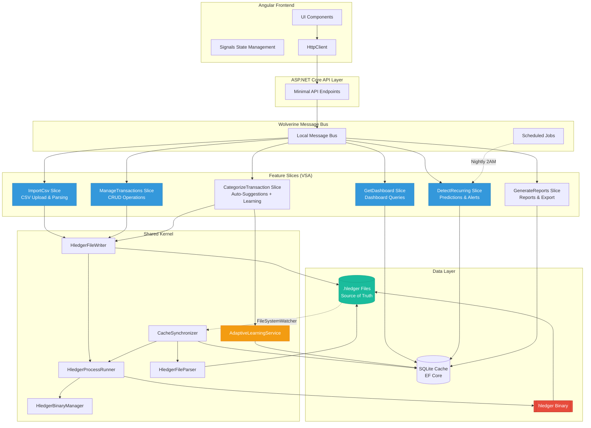

# Components

## Shared Kernel Components

### HledgerBinaryManager

**Responsibility:** Manages embedded hledger binaries across platforms (Windows/macOS/Linux). Handles extraction, permissions, version verification, and platform detection.

**Key Interfaces:**
- `Task<string> GetHledgerBinaryPath()` - Returns path to platform-appropriate hledger executable
- `Task<bool> ValidateBinary()` - Verifies SHA256 hash and executes `hledger --version`
- `Task ExtractEmbeddedBinary()` - Extracts from embedded resources on first launch
- `Task<string> GetHledgerVersion()` - Returns hledger version string (e.g., "1.32.3")

**Dependencies:**
- File system I/O (System.IO)
- Platform detection (RuntimeInformation)
- Embedded resources (Assembly.GetManifestResourceStream)

**Technology Stack:**
- **Language:** C# 12
- **Platform Detection:** `RuntimeInformation.IsOSPlatform(OSPlatform.Windows/Linux/OSX)`
- **Embedded Binaries:** hledger 1.32.3 (Windows .exe, macOS arm64/x64, Linux x64)

### HledgerProcessRunner

**Responsibility:** Executes hledger CLI commands via ProcessStartInfo, captures output (stdout/stderr), parses JSON/text responses, handles errors.

**Key Interfaces:**
- `Task<HledgerBalanceResult> GetBalances(string hledgerFilePath, string[]? accounts = null)` - Executes `hledger bal -O json`
- `Task<HledgerRegisterResult> GetRegister(string hledgerFilePath, DateRange? dateRange = null)` - Executes `hledger reg`
- `Task<ValidationResult> ValidateFile(string hledgerFilePath)` - Executes `hledger check`
- `Task<string> ExecuteCommand(string command, string[] args)` - Generic CLI execution wrapper

**Dependencies:**
- **HledgerBinaryManager** (gets binary path)
- Process execution (System.Diagnostics.Process)
- JSON parsing (System.Text.Json)
- Serilog (structured logging with correlation IDs)

**Technology Stack:**
- **Process Execution:** `ProcessStartInfo` with `RedirectStandardOutput = true`
- **JSON Parsing:** `System.Text.Json` for `hledger -O json` output
- **Timeout:** 30 seconds default (configurable for large files)

### HledgerFileWriter

**Responsibility:** Atomic write operations to .hledger files. Handles formatting, validation, backups, and cache invalidation triggers.

**Key Interfaces:**
- `Task<WriteResult> AppendTransaction(Transaction transaction, string filePath)` - Adds transaction to .hledger file
- `Task<WriteResult> UpdateTransaction(Transaction oldTransaction, Transaction newTransaction, string filePath)` - Rewrites file with updated transaction
- `Task<WriteResult> DeleteTransaction(Guid transactionCode, string filePath)` - Comments out transaction in .hledger file
- `Task<WriteResult> BulkAppend(List<Transaction> transactions, string filePath)` - CSV import optimization

**Dependencies:**
- **HledgerProcessRunner** (for `hledger check` validation)
- **TransactionFormatter** (formats Transaction model to hledger syntax)
- File system I/O with atomic operations
- **CacheMetadata** repository (updates file hash after writes)

**Technology Stack:**
- **Atomic Write Strategy:** Write to `.hledger.tmp` → validate via `hledger check` → rename to `.hledger` (atomic on POSIX/NTFS)
- **Backup:** Create `.hledger.bak` before every write
- **Format:** 2-space indentation, right-aligned amounts (pad to column 40)

### HledgerFileParser

**Responsibility:** Parses .hledger files into Transaction models for cache population. Handles external edits (FileSystemWatcher scenario).

**Key Interfaces:**
- `Task<List<Transaction>> ParseFile(string filePath)` - Full file parse
- `Task<Transaction?> FindTransactionByCode(Guid code, string filePath)` - Lookup by HledgerTransactionCode
- `Task<List<Account>> ExtractAccountDeclarations(string filePath)` - Parse account definitions

**Dependencies:**
- Text file parsing (Regex patterns for hledger syntax)
- **Data Models** (Transaction, Account)

**Technology Stack:**
- **Parsing:** Regex for transaction blocks, line-by-line parsing for multi-line postings

### CacheSynchronizer

**Responsibility:** Keeps SQLite cache in sync with .hledger files. Handles FileSystemWatcher events, rebuilds cache, validates consistency.

**Key Interfaces:**
- `Task RebuildCache(string hledgerFilePath)` - Full cache rebuild from .hledger file
- `Task ValidateCache(string hledgerFilePath)` - Check file hash, balance checksums
- `void OnFileChanged(FileSystemEventArgs e)` - FileSystemWatcher event handler
- `Task<bool> IsCacheValid(string hledgerFilePath)` - Quick validation check

**Dependencies:**
- **HledgerFileParser** (parse .hledger files)
- **HledgerProcessRunner** (execute balance queries)
- **CacheMetadata** repository (track sync state)
- FileSystemWatcher (.NET built-in)
- EF Core (bulk insert/update cache tables)

**Technology Stack:**
- **FileSystemWatcher:** Monitors .hledger file directory for changes
- **Debouncing:** 500ms delay after file change before triggering rebuild

### AdaptiveLearningService

**Responsibility:** Implements adaptive learning algorithm for categorization rules. Adjusts confidence, creates competing rules, detects patterns.

**Key Interfaces:**
- `Task LearnFromAcceptance(Guid ruleId)` - Boosts rule confidence when user accepts suggestion
- `Task LearnFromRejection(Guid ruleId, Guid correctCategoryId, string payee)` - Penalizes rule, creates competing rule if needed
- `Task LearnFromManualCategorization(Transaction transaction, Guid categoryId)` - Detects patterns in manual categorizations
- `Task<List<ImportRule>> GetTopRulesByConfidence(int count)` - Returns highest-confidence rules for UI display

**Dependencies:**
- **ImportRule** repository
- **Transaction** repository (pattern analysis)

**Algorithm:**
```
When user accepts suggestion:
  - Increment ImportRule.TimesAccepted
  - Boost Confidence: NewConfidence = (TimesAccepted / TimesApplied) * 1.1 (max 1.0)
  - Increase Priority if Confidence > 0.8

When user rejects suggestion:
  - Decrement Confidence: NewConfidence = (TimesAccepted / TimesApplied) * 0.9
  - Decrease Priority if Confidence < 0.3
  - Create competing rule if user-selected category appears 3+ times for same payee pattern

When user manually categorizes (no suggestion):
  - Check if similar payee pattern exists in last 20 transactions
  - If 3+ matches with same category, create new ImportRule with Confidence = 0.6
```

## Feature Slice Components

### ImportCsv Slice

**Responsibility:** Complete CSV import workflow - upload, parse, detect columns, map fields, suggest categories, detect duplicates, write to .hledger file.

**Key Interfaces:**
- `POST /api/import/csv` → `ImportCsvCommand` handler
- `POST /api/import/preview` → `PreviewCsvCommand` handler
- `GET /api/import/mappings` → `GetSavedMappingsQuery` handler
- `POST /api/import/save-mapping` → `SaveColumnMappingCommand` handler

**Dependencies:**
- **CsvHelper** library
- **HledgerFileWriter**
- **ImportRule** repository
- **Transaction** repository
- **CsvImport** repository

### GetDashboard Slice

**Responsibility:** Query cached data for all dashboard widgets including the **prominent Cash Flow Timeline** (primary differentiator).

**Key Interfaces:**
- `GET /api/dashboard` → `GetDashboardQuery` handler
- `GET /api/dashboard/networth` → `GetNetWorthQuery` handler
- `GET /api/dashboard/expenses` → `GetExpenseBreakdownQuery` handler
- `GET /api/dashboard/income-expense` → `GetIncomeExpenseQuery` handler
- `GET /api/dashboard/cashflow-timeline?days={30|60|90}` → `GetCashFlowTimelineQuery` handler

**Cash Flow Timeline Response:**
```json
{
  "currentBalance": 2500.00,
  "asOfDate": "2025-01-15",
  "predictions": [
    {
      "date": "2025-01-16",
      "predictedBalance": 2455.00,
      "confidence": 0.95
    }
  ],
  "recurringMarkers": [
    {
      "date": "2025-01-15",
      "payee": "Netflix",
      "amount": -15.99,
      "categoryName": "Entertainment",
      "categoryIcon": "movie",
      "categoryColor": "#9B59B6"
    }
  ],
  "alerts": [
    {
      "type": "Overdraft",
      "date": "2025-02-15",
      "message": "Predicted overdraft on Feb 15 ($-45.00)",
      "actionableSuggestion": "Consider reducing discretionary spending or transferring funds",
      "impact": 45.00
    }
  ]
}
```

**Dependencies:**
- **Transaction** repository
- **Account** repository
- **RecurringTransaction** repository
- **HledgerProcessRunner**

### ManageTransactions Slice

**Responsibility:** CRUD operations for transactions - add, edit, delete, search, filter, batch operations.

**Key Interfaces:**
- `POST /api/transactions` → `AddTransactionCommand` handler
- `PUT /api/transactions/{id}` → `UpdateTransactionCommand` handler
- `DELETE /api/transactions/{id}` → `DeleteTransactionCommand` handler
- `GET /api/transactions` → `GetTransactionsQuery` handler
- `POST /api/transactions/batch` → `BatchCategorizeCommand` handler

**Dependencies:**
- **HledgerFileWriter**
- **Transaction** repository
- **HledgerFileAudit** repository

### DetectRecurring Slice

**Responsibility:** Detect recurring transaction patterns, generate cash flow predictions, alert on overdrafts.

**Key Interfaces:**
- `POST /api/predictions/detect` → `DetectRecurringCommand` handler (Wolverine scheduled job, nightly)
- `GET /api/predictions/recurring` → `GetRecurringTransactionsQuery` handler
- `POST /api/predictions/confirm/{id}` → `ConfirmRecurringCommand` handler
- `GET /api/predictions/cashflow` → `GetCashFlowPredictionQuery` handler

**Dependencies:**
- **Transaction** repository
- **RecurringTransaction** repository
- **Prediction Algorithm** (pattern matching)

**Technology:**
- **Scheduled Job:** Wolverine runs daily at 2 AM
- **Detection Algorithm:** Sliding window (last 6 months), minimum 4 occurrences

### CategorizeTransaction Slice

**Responsibility:** Auto-suggest categories, apply import rules, **learn adaptively from user corrections** through Bayesian-inspired confidence adjustment.

**Key Interfaces:**
- `POST /api/categorize` → `CategorizeTransactionCommand` handler
- `POST /api/categorize/batch` → `BatchCategorizeCommand` handler
- `GET /api/categorize/suggestions/{transactionId}` → `GetCategorySuggestionsQuery` handler
- `POST /api/categorize/learn` → `LearnFromCorrectionCommand` handler

**Dependencies:**
- **ImportRule** repository
- **Transaction** repository
- **HledgerFileWriter**
- **AdaptiveLearningService**

**Learning Impact:**
- First CSV import: ~50% accuracy
- After 10 corrections: ~65% accuracy
- After 3 months: ~75-80% accuracy (FR7 target)

### GenerateReports Slice

**Responsibility:** Category-based reports, time period filtering, comparisons, PDF/CSV export.

**Key Interfaces:**
- `GET /api/reports/expenses` → `GetExpenseReportQuery` handler
- `GET /api/reports/comparison` → `GetComparisonReportQuery` handler
- `POST /api/reports/export/pdf` → `ExportPdfCommand` handler

**Dependencies:**
- **Transaction** repository
- **Category** repository
- jsPDF (client-side PDF generation)

## Component Diagram



---
