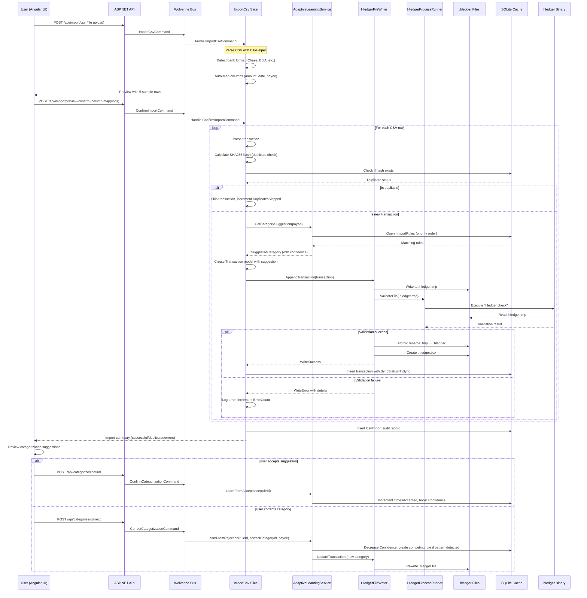
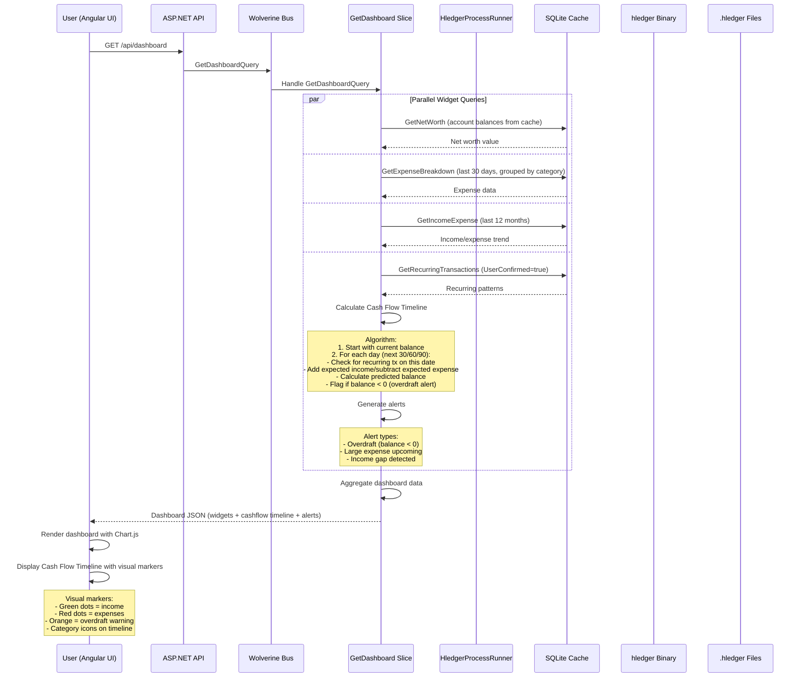
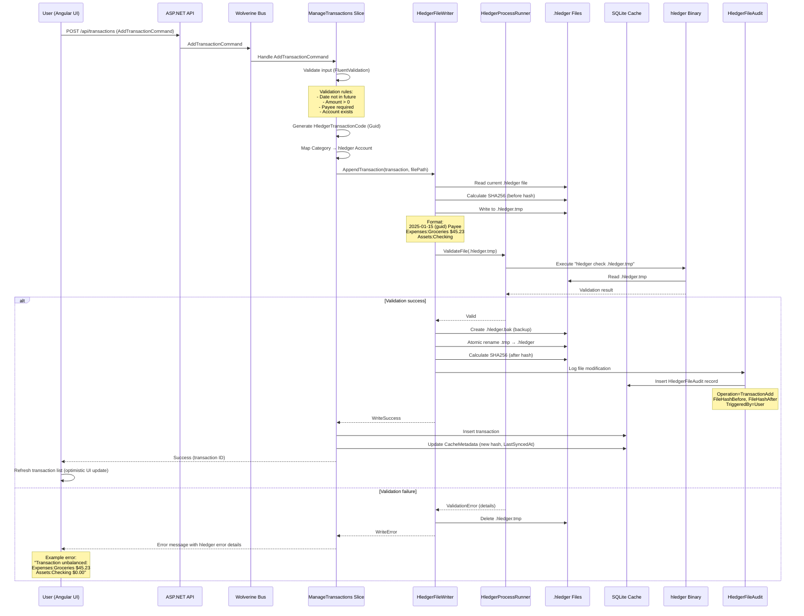
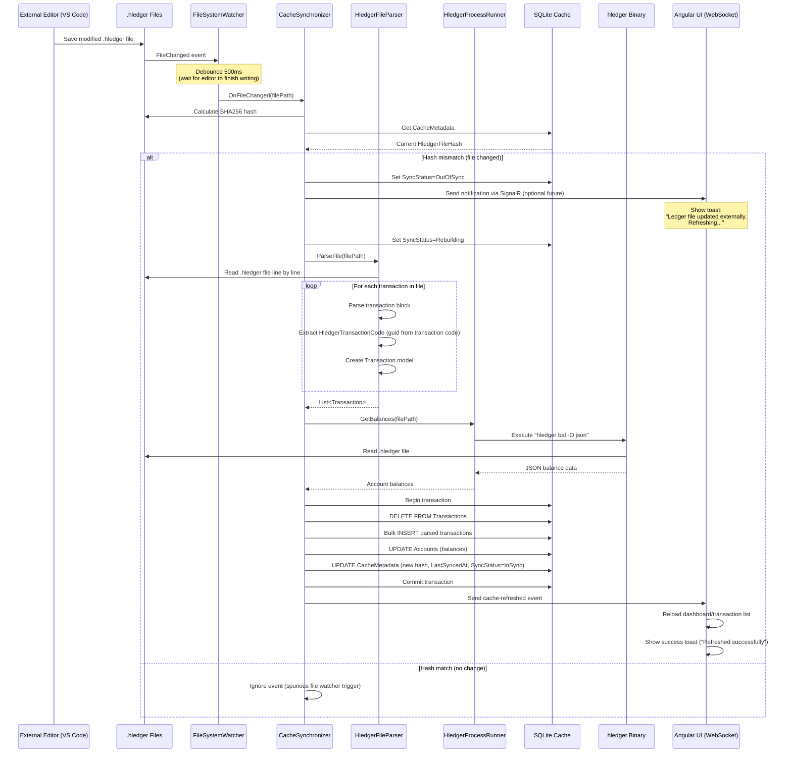
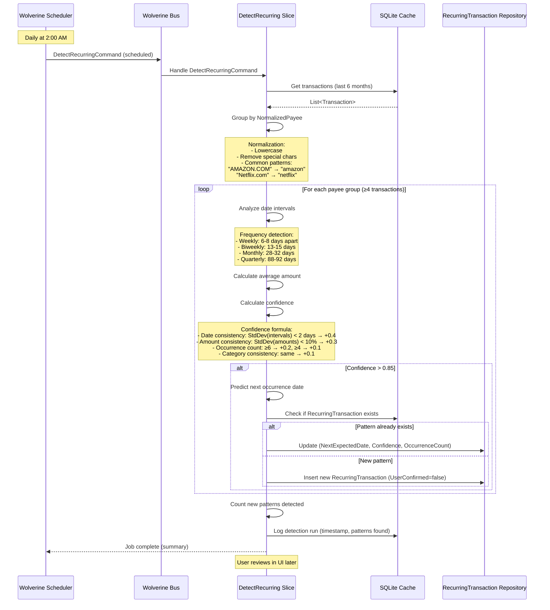
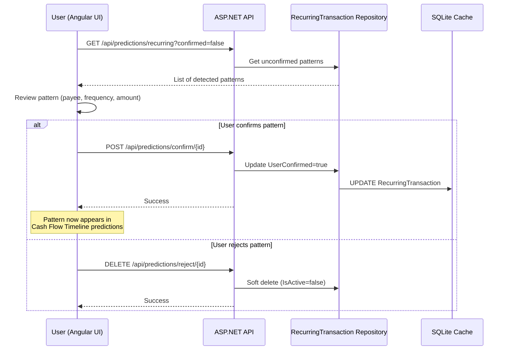

# Core Workflows

This section documents the critical user journeys with sequence diagrams showing interactions between frontend, backend, hledger binary, and data storage.

## CSV Import Workflow

**User Story:** User uploads bank CSV file, maps columns, reviews suggestions, confirms import.

**Success Criteria:**
- >95% successful transaction parsing (NFR9)
- Duplicate detection 100% accurate (FR4)
- Adaptive learning creates rules from corrections (FR6, FR7)

**Performance Targets:**
- 1000 transactions: <5 seconds import time
- Duplicate detection: O(n) with hash lookup
- Categorization suggestions: <50ms per transaction (priority-ordered rule matching)

---

## Dashboard Load with Cash Flow Timeline

**User Story:** User opens dashboard, sees net worth, expense breakdown, income/expense chart, and **Cash Flow Timeline with predictions**.

**Success Criteria:**
- Dashboard loads in <2 seconds (NFR1)
- Cash Flow Timeline shows 30/60/90 day predictions
- Overdraft alerts displayed if predicted balance <0

**Caching Strategy:**
- Account balances cached on app start (refreshed on .hledger file change)
- Recurring transactions cached (refreshed nightly via scheduled job)
- Dashboard queries hit cache only (no hledger CLI execution for <2s load)

---

## Add Transaction Manually

**User Story:** User adds transaction via UI form (date, payee, amount, category).

**Success Criteria:**
- Transaction written to .hledger file with atomic operations
- 100% validation via hledger binary (NFR14)
- Cache updated immediately for instant UI refresh

**Error Handling:**
- FluentValidation errors returned immediately (no file I/O)
- hledger validation errors preserved exactly as CLI output
- Rollback automatic (atomic rename fails → .tmp file deleted)
- Backup always created before modification

---

## External .hledger File Edit Detection

**User Story:** User edits .hledger file in VS Code while app is running. App detects change, rebuilds cache, shows notification.

**Success Criteria:**
- FileSystemWatcher detects changes within 500ms
- Cache rebuild completes within 2 seconds for <10K transactions
- UI shows non-blocking notification ("Ledger file updated externally. Refreshing...")

**Edge Cases Handled:**
- Multiple rapid saves → debounced to single rebuild
- File deleted → show error, preserve cache, disable writes
- File corrupted → show hledger error, preserve cache
- Concurrent writes (app + external) → last write wins, cache rebuilds

---

## Recurring Transaction Detection (Scheduled Job)

**User Story:** System runs nightly job to detect recurring patterns. User reviews/confirms patterns in UI.

**Success Criteria:**
- Nightly execution at 2 AM (Wolverine scheduled job)
- Minimum 4 occurrences + >0.85 confidence
- User confirmation required before predictions appear in Cash Flow Timeline

**User Confirmation Flow:**

---
