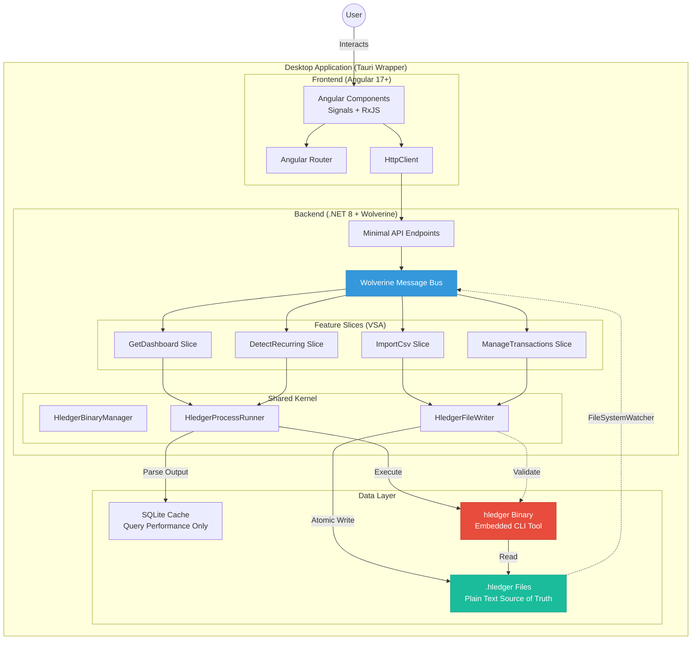

# High Level Architecture

## Technical Summary

Ledgerly employs an **event-driven monolith** architecture using **Vertical Slice Architecture (VSA)** to organize features as self-contained vertical slices. The system integrates an **embedded hledger binary** as the authoritative double-entry accounting engine, with plain text `.hledger` files serving as the single source of truth.

The backend uses **.NET 8 with Wolverine** for command/event handling, enabling async workflows (CSV import, recurring transaction detection) while maintaining simplicity appropriate for a local-first desktop application. The **Angular 17+ frontend** with Signals provides reactive UI updates, wrapped in a **Tauri desktop shell** for cross-platform distribution. **SQLite serves exclusively as a cache layer** for query performance—never storing authoritative financial data.

This architecture directly supports the PRD's core goals: offline-first operation (NFR6), PTA transparency through real hledger integration (FR21, FR23), and developer-friendly feature organization that enables rapid iteration by a solo developer.

## High Level Overview

**1. Architectural Style:** Event-Driven Monolith with Embedded CLI Integration

**2. Repository Structure:** Monorepo (single repository, multiple projects organized by VSA)
```
Ledgerly/
├── src/Ledgerly.Api/          # .NET backend with Wolverine
├── src/Ledgerly.Web/          # Angular frontend
├── src/Ledgerly.Desktop/      # Tauri wrapper
└── src/Ledgerly.Contracts/    # Shared DTOs
```

**3. Service Architecture:** Single-process desktop application with three integrated layers:
   - **Presentation Layer:** Angular SPA (TypeScript, Signals, RxJS)
   - **Application Layer:** .NET API + Wolverine message bus (commands/queries/events)
   - **Domain Layer:** Embedded hledger binary (battle-tested double-entry engine)

**4. Primary Data Flow:**
```
User Action (UI)
  → Angular HTTP Client
  → ASP.NET Minimal API Endpoint
  → Wolverine Command Handler
  → Write .hledger file (atomic)
  → Execute hledger binary (validation/calculation)
  → Parse output → Cache in SQLite
  → Return to UI
```

**5. Key Architectural Decisions:**

| Decision | Rationale | Trade-off Accepted |
|----------|-----------|-------------------|
| **Embedded hledger binary** | Avoid reimplementing 20+ years of battle-tested accounting logic; ensures PTA authenticity | Process spawning overhead (~50-200ms per query); dependency on external binary |
| **Vertical Slice Architecture** | Feature cohesion for solo developer; clear boundaries; parallel development of features | Some code duplication vs. premature abstraction (Rule of Three) |
| **Wolverine for messaging** | Local async workflows (import, predictions) without distributed system complexity | Learning curve for .NET developers unfamiliar with Wolverine |
| **Tauri over Electron** | 10-15MB bundles vs. 50-100MB; Rust security; native performance | Less mature ecosystem; **Week 1 validation gate** to confirm viability |
| **.hledger files as source of truth** | Complete data ownership, CLI interoperability, version control friendly | Need atomic write operations and cache invalidation logic |

## High Level Project Diagram



## Architectural and Design Patterns

**1. Vertical Slice Architecture (VSA)**
Each feature is organized as a self-contained vertical slice containing all layers (endpoint → handler → domain logic → tests).
**Rationale:** Solo developer friendly; features don't collide during parallel development; natural CQRS fit with Wolverine commands/queries. Aligns with PRD's VSA requirement and simplifies navigation (`Features/ImportCsv/` contains everything for CSV import).

**2. Command Query Responsibility Segregation (CQRS) - Lightweight**
Commands (ImportCsvCommand, AddTransactionCommand) modify state; Queries (GetDashboardQuery) read data. Wolverine enforces separation.
**Rationale:** Clear intent, optimized read paths (SQLite cache), write paths (hledger validation). Not full event sourcing—appropriate complexity for desktop app.

**3. Repository Pattern - Adapted for Plain Text**
`HledgerFileWriter` and `HledgerQueryRunner` abstract .hledger file operations and hledger CLI execution.
**Rationale:** Enables testing (mock file I/O and CLI calls); centralizes atomic write logic and parsing; future-proofs migration to different PTA formats (beancount).

**4. Event-Driven Architecture - Local Messaging**
Wolverine local message bus handles async workflows (CSV import → categorization suggestions → cache refresh).
**Rationale:** Decouples long-running operations from HTTP requests; enables scheduled jobs (nightly recurring transaction detection); supports future cloud sync without architectural rewrite.

**5. Cache-Aside Pattern**
SQLite caches hledger query results; cache invalidated on .hledger file changes (FileSystemWatcher trigger).
**Rationale:** hledger CLI queries can be 50-200ms; caching achieves <2s dashboard load (NFR1). Source of truth remains .hledger files.

**6. Strangler Fig Pattern - For hledger Integration**
Start with hledger CLI via ProcessStartInfo; optionally migrate to hledger library bindings (Haskell FFI) in Phase 2 if performance requires.
**Rationale:** De-risks MVP by using proven CLI; leaves optimization path open. Week 6 performance tests with 50K transactions will validate if migration needed.

**7. Atomic Transaction Pattern - File Operations**
Temp file → `hledger check` validation → rename to .hledger → create .hledger.bak backup.
**Rationale:** Prevents corruption (NFR11: zero data loss); ensures 100% validation compliance (NFR14).

**8. Adapter Pattern - CSV Parsing**
BankCsvAdapter interface with concrete implementations (ChaseAdapter, BofAAdapter) maps diverse CSV formats to standard transaction model.
**Rationale:** Handles 20+ bank CSV formats (FR2, NFR9: >95% success rate); isolates format-specific logic; enables community contributions for new bank formats.

---
