```mermaid
graph TD
    Start([User sees uncategorized banner]) --> ClickCategorize[Click Categorize Now]
    ClickCategorize --> FilteredList[Transactions page: uncategorized only]

    FilteredList --> FirstTrans[Show first uncategorized transaction]
    FirstTrans --> HasSuggestion{Category<br/>suggested?}

    HasSuggestion -->|Yes - Green| ShowGreen[Green checkmark: Amazon → Shopping]
    HasSuggestion -->|Maybe - Yellow| ShowYellow[Yellow warning: Unknown vendor]
    HasSuggestion -->|No| ShowBlank[Blank category field]

    ShowGreen --> UserAccepts{User action?}
    UserAccepts -->|Click checkmark| AutoAccept[Auto-accept suggestion]
    UserAccepts -->|Click dropdown| ShowOptions[Show category dropdown]

    ShowYellow --> UserOverride[User types or selects]
    ShowBlank --> UserOverride

    ShowOptions --> UserSelects[User selects different category]
    UserSelects --> UpdateRule[Update Import Rule]
    UserOverride --> UpdateRule
    AutoAccept --> NextTrans[Move to next transaction]

    UpdateRule --> ShowLearning[Tooltip: Ledgerly learns from corrections]
    ShowLearning --> NextTrans

    NextTrans --> MoreTrans{More uncategorized<br/>transactions?}
    MoreTrans -->|Yes| FirstTrans
    MoreTrans -->|No| AllDone[All transactions categorized!]

    AllDone --> UpdateDashboard[Dashboard refreshes charts]
    UpdateDashboard --> End([Complete])
```

# Ledgerly UI/UX Specification

## Introduction

This document defines the user experience goals, information architecture, user flows, and visual design specifications for **Ledgerly**'s user interface. It serves as the foundation for visual design and frontend development, ensuring a cohesive and user-centered experience.

Ledgerly is a **local-first, dashboard-driven personal finance manager** that bridges the power of Plain Text Accounting (Ledger, hledger, beancount) with the intuitiveness of modern consumer finance apps. Unlike cloud-based competitors (YNAB, Mint) or utilitarian PTA tools (Fava), Ledgerly combines:

- **Data Ownership:** Local SQLite storage with portable Ledger file exports (no vendor lock-in)
- **Predictive Intelligence:** Cash flow timeline forecasting and recurring transaction detection
- **Developer Aesthetic:** Clean, modern UI inspired by VS Code and GitHub (not consumer finance pastels)
- **Privacy-First:** Fully offline, no telemetry, no cloud dependency

**Competitive Positioning:** *"Ledger's power, YNAB's ease, your data."*

### Change Log

| Date | Version | Description | Author |
|------|---------|-------------|--------|
| 2025-10-03 | 1.0 | Initial UI/UX Specification | Sally (UX Expert) |

---

## Overall UX Goals & Principles

### Target User Personas

#### Persona 1: Frustrated CLI Power User (Primary - MVP Focus)

- **Profile:** Software developers, sysadmins, data analysts (age 28-45) who currently use `ledger`/`hledger` CLI tools
- **Technical Comfort:** High - comfortable with terminal, git, text editors
- **Pain Points:**
  - Monthly reconciliation takes 2-3 hours (140+ minutes)
  - Manual duplicate detection prone to errors
  - Categorization requires memorizing category names and typing repeatedly
  - Spouse/partner can't access financial data without CLI knowledge
  - No visual spending pattern recognition (parsing CLI text output is tedious)
- **Current Workflow:** Download bank CSVs → bash scripts to parse → Vim editing → manual categorization → `ledger bal` validation
- **Goals:**
  - Reduce monthly reconciliation time by 50%+ (target: <30 minutes)
  - Maintain PTA workflow and data portability
  - Enable household financial transparency without teaching partner CLI skills
  - Preserve complete data ownership and privacy
- **Quote:** *"I love Ledger's control, but I spend more time parsing CLI output than analyzing my finances."*
- **Example:** David, Senior Software Engineer with 3 bank accounts, reconciles monthly, values data ownership but tired of manual workflows

#### Persona 2: PTA-Curious Technical User (Secondary - MVP Support)

- **Profile:** Tech-savvy professionals (developers, designers, product managers) who've heard of Plain Text Accounting but find CLI too intimidating
- **Technical Comfort:** Medium-High - comfortable with apps/software but avoid terminal when possible
- **Pain Points:**
  - Want to escape YNAB subscriptions ($99/year feels like rent) and Mint privacy issues
  - Read Ledger documentation multiple times but don't know where to start
  - Intimidated by CLI learning curve and fear of breaking things
  - Desire data portability but need GUI to get started
- **Current Workflow:** Using YNAB or spreadsheets, frustrated with limitations
- **Goals:**
  - Own their financial data without vendor lock-in
  - Learn PTA concepts gradually through GUI (not forced to learn CLI upfront)
  - Avoid cloud services and subscription fees
  - Export to portable formats if they outgrow the tool
- **Quote:** *"I read the Ledger docs three times and still don't know where to start."*
- **Example:** Sarah, Product Manager, wants privacy and control but needs visual interface to understand PTA concepts

#### Persona 3: Non-Technical Household Member (Phase 2 - Read-Only Access)

- **Profile:** Spouses, partners, or household members of Persona 1 who need financial insights without technical expertise
- **Technical Comfort:** Low-Medium - comfortable with consumer apps (banking apps, email) but intimidated by terminal
- **Pain Points:**
  - Can't check account balance without asking partner
  - Wants to understand household spending but terminal is intimidating
  - Needs to answer "Can we afford this purchase?" independently
- **Goals:**
  - Answer basic questions: current balance, spending this month, budget status
  - View financial insights without CLI knowledge
  - Contribute to financial decisions with shared understanding
- **Quote:** *"I just want to see if we're on track this month, not learn regex."*
- **Example:** Emily, David's wife, wants financial visibility but doesn't need (or want) full control over categorization

---

### Usability Goals

Based on Persona 1's journey map (monthly reconciliation workflow reducing 140 minutes to 20 minutes), these measurable usability goals guide design decisions:

1. **Instant Gratification (First-Launch Experience)**
   - New users see meaningful financial insights within **10 seconds** of first CSV import
   - Dashboard never shows empty state; first import triggers automatic chart generation
   - Success metric: Time from app launch to "I can see where my money went" < 60 seconds

2. **Efficient Reconciliation (Core Workflow Optimization)**
   - Monthly bank statement import + categorization takes **<20 minutes** for 200-300 transactions (vs. 140 minutes in CLI)
   - Breakdown: Import (2 min) + Deduplication (5 min) + Categorization (10 min) + Verification (3 min)
   - Success metric: 85%+ of users complete monthly reconciliation in <30 minutes

3. **Progressive Complexity Disclosure (Learning Curve Management)**
   - Beginners accomplish core tasks (import CSV, view dashboard, categorize transactions) without documentation
   - Power users discover advanced features naturally (keyboard shortcuts, split transactions, custom categories) through UI affordances
   - Success metric: 90%+ of first-time users successfully import and categorize first CSV without help docs

4. **Error Prevention & Recovery (Trust & Data Integrity)**
   - Duplicate detection prevents accidental re-imports (23 duplicates caught automatically in user journey)
   - Balance validation alerts to discrepancies before saving
   - Ledger file compatibility checks ensure 100% valid exports
   - Success metric: <0.1% data corruption incidents; zero invalid Ledger file exports

5. **Household Accessibility (Phase 2 - Shared Understanding)**
   - Non-technical users (Persona 3) can view financial insights and answer basic questions without terminal knowledge
   - Read-only dashboard access requires zero CLI learning
   - Success metric: 80%+ of household members can independently answer "Can we afford [X]?"

6. **Cognitive Load Reduction (Category Consistency)**
   - Auto-complete and suggestions eliminate memorizing category names (Persona 1 pain point)
   - Learning from corrections improves suggestion accuracy to 80%+ after 3 months
   - Success metric: 80%+ of categorization via one-click accept (not manual typing)

---

### Design Principles

These principles guide every design decision, interaction pattern, and visual treatment:

#### 1. Show Me My Money, Then Let Me Explore
**Philosophy:** Dashboard answers "Where did my money go?" immediately. Drill-downs answer "Why?" on demand.

- **In Practice:**
  - Dashboard is the landing page (not transaction list or settings)
  - Top 3 widgets visible without scrolling: Cash Flow Timeline, Expense Breakdown, Net Worth
  - Every chart is clickable → drills down to transaction details
  - No hunting through menus for basic insights (balance, top categories, recent transactions)

- **Trade-off:** Prioritizes overview over detail; users who want transaction list must click (acceptable for target personas)

#### 2. Transparency Without Overwhelm
**Philosophy:** Every prediction, categorization, and calculation shows its reasoning—but users don't have to engage unless they want to.

- **In Practice:**
  - Category suggestions show confidence indicators (green checkmark = high confidence, yellow = review needed)
  - Cash Flow Timeline includes tooltip: "Based on 12 recurring transactions detected from last 6 months"
  - Duplicate detection shows expandable list: "23 duplicates auto-skipped" with "Review Duplicates" button
  - Ledger file preview available in Settings (but not required workflow)

- **Trust Signal:** Users can verify the system's work, building confidence over time

#### 3. Developer Tool Aesthetic, Consumer App Polish
**Philosophy:** Clean typography, thoughtful spacing, dark mode—but no cutesy illustrations or patronizing language. Respect the user's intelligence.

- **In Practice:**
  - Visual inspiration: VS Code, GitHub, Linear (not YNAB pastels or Mint's friendly mascots)
  - Color palette: Deep blues (#2C3E50), teal accents (#1ABC9C), semantic colors (red for warnings, green for positive trends)
  - Typography: Monospace for amounts and Ledger file previews; sans-serif (Inter/Roboto) for UI text
  - Tone: Professional, precise, empowering (not "Great job!" or "You're doing amazing!")

- **Example:** Success message: "Imported 198 transactions" (not "Woohoo! You're on fire! 🔥")

#### 4. Offline Forever, Cloud Never (MVP Scope)
**Philosophy:** Every feature works without internet. No loading spinners waiting for APIs. Your data stays on your machine.

- **In Practice:**
  - No cloud icon anywhere in UI (visual cue of local-first commitment)
  - All features function with airplane mode enabled
  - Database stored locally: `~/.ledgerly/ledger.db`
  - Export button prominently placed (footer + Settings) to reinforce "no lock-in"

- **Trust Signal:** Privacy-first users see zero network requests in DevTools

#### 5. Portable by Default
**Philosophy:** Export Ledger files with one click. No proprietary formats. If you outgrow Ledgerly, your data migrates seamlessly.

- **In Practice:**
  - "Export Ledger File" button always visible (dashboard footer)
  - Generated `.ledger` files pass `ledger -f file.dat bal` validation 100% of the time
  - Settings show real-time Ledger file preview with syntax highlighting
  - No feature requires staying in Ledgerly (all data exportable)

- **Competitive Differentiation:** Unlike YNAB (proprietary format), Fava (Beancount-only), or Mint (no export), Ledgerly treats exports as first-class feature

---

## Information Architecture (IA)

### Site Map / Screen Inventory

### Navigation Structure

**Primary Navigation:** Left sidebar with icon + label, always visible on desktop. Collapsed to icons-only on smaller screens (<1366px).

- **Dashboard** (home icon) - Default landing page showing overview widgets
- **Transactions** (list icon) - Full transaction list with search/filter capabilities
- **Reports** (chart-bar icon) - Category-based expense/income reports with export
- **Cash Flow** (trending-up icon) - Predictive timeline forecasting (unique differentiator - prominent placement)
- **Settings** (gear icon) - Account management, categories, import rules, Ledger export

**Secondary Navigation:** Context-dependent interactions within each primary page.

- **Dashboard widgets:** Each widget is clickable, enabling drill-down to detail views
  - Click category (e.g., "Groceries") in Expense Breakdown chart → Transactions page filtered by that category
  - Click month bar in Income vs Expense chart → Reports view for that time period
  - Click recurring transaction marker in Cash Flow Timeline → Transaction detail modal

- **Transaction list:** Inline actions and batch operations
  - Click any transaction row → Opens edit modal (overlay, preserves list context)
  - Select multiple via checkboxes → Batch action toolbar appears (categorize, delete operations)
  - Search bar and filter dropdowns (date range, category, account) persist as query parameters

- **Reports view:** Time period selector and comparison controls
  - Dropdown: This Month, Last Month, This Quarter, This Year, Custom Date Range
  - Comparison toggle: "Compare to previous period" (shows side-by-side or overlay visualization)

**Breadcrumb Strategy:** Displayed only when user navigates via drill-down (not on primary navigation pages).

- Shows hierarchical path: `Dashboard > Expenses: Groceries > Transaction #1234`
- Each breadcrumb level is clickable to navigate back up hierarchy
- **Not displayed** on primary pages (Dashboard, Transactions, Reports, Settings) - these are top-level destinations
- Reduces visual clutter while providing wayfinding for drill-down navigation

**Quick Actions (Floating Action Button - Bottom Right Corner):**

- **Import CSV** (primary action - teal accent color, larger button)
- **Add Transaction** (secondary action - smaller, stacked below primary)
- Always accessible regardless of current page (fixed position)
- Desktop: Icon + label on hover; Mobile: Icon-only with tooltip
- Rationale: Monthly CSV import is critical workflow - must be accessible from any page

---

## User Flows

### Flow 1: Monthly CSV Import & Reconciliation

**User Goal:** Import monthly bank statements, categorize transactions, and verify account balances

**Entry Points:**
- Dashboard "Import CSV" button (FAB - bottom right)
- First launch wizard (if no transactions exist)
- Settings > Import History > "Import New CSV"

**Success Criteria:**
- 198 new transactions imported (23 duplicates skipped)
- All transactions categorized (auto or manual)
- Account balances match bank statements
- Completion time: <20 minutes for 200-300 transactions

#### Flow Diagram

#### Edge Cases & Error Handling

**CSV Processing:**
- **Invalid CSV format:** Show error: "Unable to parse CSV. Check file encoding (UTF-8) and delimiter."
- **All transactions are duplicates:** Show info: "All 150 transactions already imported. No new transactions added."
- **CSV too large (>10,000 rows):** Show warning: "Large file detected. Import may take 30-60 seconds." + progress bar
- **Encoding issues (ISO-8859-1):** Auto-detect and convert to UTF-8; notify user if conversion uncertain
- **Missing required columns:** Manual mapping UI shows validation error: "Date and Amount columns required"
- **Balance mismatch after import:** Show alert: "Account balance doesn't match expected total. Review transactions for errors."

**Duplicate Detection:**
- **Fuzzy matching algorithm:**
  1. **Exact match (100%):** Date exact, Amount exact, Payee exact → Green checkmark, suggest skip
  2. **High confidence (95%):** Date ±1 day, Amount exact, Payee normalized match → Yellow warning, suggest skip
  3. **Medium confidence (80%):** Date ±3 days, Amount ±$0.05, Payee fuzzy match → Show for review, no auto-suggest
  4. **Low confidence (<80%):** Don't flag as duplicate

- **Duplicate scope:**
  - **Within-file:** Check each CSV for internal duplicates
  - **Cross-file:** Check new transactions against ALL existing database transactions
  - **Breakdown shown:** "23 duplicates (15 from previous imports, 8 across today's 3 files)"

- **Transfer detection:** Cross-file duplicates with opposite amounts flagged as potential transfers: "Same transaction in Checking.csv and Savings.csv - Mark as Transfer?"

- **False positive recovery:**
  - Immediate: Toast notification with "Undo" button (10 second timeout)
  - Later: Settings > Import History > Skipped Transactions > Select > "Import This Transaction"

- **Side-by-side comparison UI shows:**
  - Date, Amount, Payee, Memo, Source (which file/import)
  - Differences highlighted in yellow
  - Confidence indicator (green checkmark, yellow warning, gray question mark)
  - Actions: "Skip This Duplicate" (primary), "Import Anyway" (secondary), "Skip All Remaining" (tertiary)

**Notes:** Multi-file import (3 CSVs at once) is critical for Persona 1's workflow. Improved duplicate detection with fuzzy matching and user confirmation prevents data loss while maintaining efficiency.

---

### Flow 2: Categorize Uncategorized Transactions

**User Goal:** Quickly categorize transactions that weren't auto-categorized during import

**Entry Points:**
- Dashboard banner: "15 transactions need categorization" (click to start)
- Transactions page filtered to uncategorized only
- Post-import prompt: "104 imported, 15 need categorization" → "Categorize Now" button

**Success Criteria:**
- All 15 transactions categorized in <5 minutes
- Category suggestions improve over time (learning from user corrections)
- 80%+ categorization via one-click accept (not manual typing)

#### Flow Diagram

#### Edge Cases & Error Handling

- **User creates new category mid-flow:** Autocomplete allows typing new category name; saved to Categories table immediately
- **Keyboard shortcuts:** Enter = accept suggestion, Tab = next field, Escape = cancel edit
- **Bulk categorization:** Select 10 transactions with same payee → batch categorize all as "Groceries"
- **Split transaction:** Transaction needs multiple categories (Costco = Groceries $120 + Household $45) → "Split Transaction" button opens modal with auto-validation (sum must equal total)

**Notes:** Learning indicator ("Ledgerly learns from your corrections") reinforces unique value vs. static rule-based categorization.

---

### Flow 3: View Cash Flow Timeline & Manage Predictions

**User Goal:** Understand predicted balance over next 30-90 days and adjust recurring transactions

**Entry Points:**
- Dashboard: Cash Flow Timeline widget (click to expand)
- Primary navigation: Cash Flow page
- Dashboard alert: "Predicted overdraft on Feb 15" → click to investigate

**Success Criteria:**
- User can see predicted balance for any date in next 90 days
- Recurring transactions are clearly marked (rent, subscriptions, salary)
- Overdraft warnings are actionable ("Reduce dining by $100 to avoid overdraft")

#### Flow Diagram

#### Edge Cases & Error Handling

- **No recurring transactions detected:** Show message: "No recurring transactions found. Import 3+ months of data for predictions."
- **Insufficient data (<30 days):** Timeline shows actual balance only; predictions grayed out with tooltip: "Need 60+ days of data for accurate predictions"
- **Prediction confidence low:** Use lighter shading + tooltip: "Prediction based on limited data (2 months). Accuracy improves over time."
- **User cancels recurring transaction:** Prompt: "Remove Netflix from future predictions? Past transactions unchanged."
- **Variable recurring amounts (utilities):** Show range instead of exact amount: "Electric: $85-$120 (avg $98)"

**Notes:** This is the unique differentiator for Ledgerly. Must be visually prominent on dashboard and easy to understand without PTA knowledge. Transparency tooltip ("Based on 12 recurring transactions detected from last 6 months") builds trust.

---

